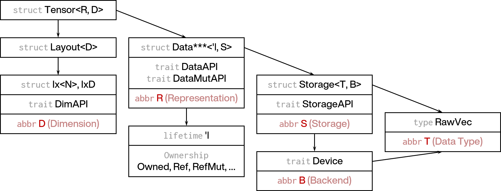

## RSTSR: Draft of a Rust High-Dimensional Tensor Data Structure Processing Program Built on the Python Array API

## Abstract

When writing scientific computing programs, the data storage structure and how to use that data structure for efficient computation are important and fundamental problems that need to be planned early. Today, NumPy and PyTorch have almost become the de facto standards for high-dimensional tensor data structures; the latter also provides a relatively unified interface for heterogeneous programming. But outside Python, except for the LibTorch library in C++, few languages support both high-dimensional tensors and heterogeneous programming. We hope the RSTSR program can resolve this dilemma in the Rust language in the future. The current RSTSR program is based on the Python Array API standard (a subset of the NumPy API), and has correctly implemented some important high-dimensional tensor operations and manipulations, exposing part of the interface in preparation for high-performance CPU computation and GPU computation. But for the goal of reimplementing most computational chemistry concerns on CPU, the current progress still needs 5–10 weeks; CUDA support may need even more time and effort. This document will 1) briefly analyze the current state of existing matrix or tensor libraries; 2) explain the practical significance and goals of the Rust tensor library RSTSR; 3) provide technical details on the features already implemented in RSTSR.

<!-- truncate -->

:::info

This document was transcribed from the original typst report to mdx format by AI. The transcription was performed by Deepseek-v4-flash.<br/>**This document is an early document and does not reflect the current RSTSR design architecture or usage.**

:::

## 1. Analysis of the Current State of Matrix or Tensor Libraries

### 1.1. Matrix or Tensor Libraries Used by Computational Chemistry Programs

We write tensor libraries, which could be a contribution to the scientific computing community, or even to machine learning and visual rendering communities; but in the final analysis, our goal is still to serve computational chemistry programs. To that end, let us briefly review the matrix or tensor libraries used in computational chemistry.

| Quantum chemistry software | Tensor or modern library | Development status |
| --- | --- | --- |
| Q-Chem | libtensor | Team-developed, tensor contraction and symmetrization, [open-source](https://github.com/epifanovsky/libtensor) |
|  | liblas | BLAS/cuBLAS wrapper |
|  | libmathtools | Team-developed, early matrix/tensor library |
| PySCF | NumPy | External library, matrix/tensor scaling, matrix multiplication |
|  | SciPy | External library, matrix linear algebra |
|  | `np_helper` | Developed by the library author, supplements NumPy functionality, [open-source](https://github.com/pyscf/pyscf/tree/master/pyscf/lib/np_helper) |
|  | TBLIS | External library, tensor contraction, [open-source](https://github.com/devinamatthews/tblis) |
| Psi4 | libmints/matrix | Team-developed, matrix operations, [open-source](https://github.com/psi4/psi4/blob/7bfb86a14500e1fb757d91ab799e05163575921b/psi4/src/psi4/libmints/matrix.cc) |
| Psi4NumPy | opt_einsum, NumPy | Developed by the library author, tensor contraction, [open-source](https://github.com/dgasmith/opt_einsum) |
| MPQC | MADNESS | Team-developed, tensor contraction and differential equations, [open-source](https://github.com/m-a-d-n-e-s-s/madness) |

This table only shows that a rough program survey was carried out, and does not necessarily prove anything:
- Q-Chem spans a very long development history, developed from the 95's to today, with many old but still usable programs (e.g., `ccman`), and also `libtensor`, a fully-featured tensor library developed in modern C++ (e.g., `ccman2`); different programs use completely different tensor or linear algebra libraries, with no unified programming standard and a large variance in code quality.
- PySCF did not deeply optimize for efficiency and large-system algorithms at its design time, but can achieve efficient implementations on small systems. This can be done through Python/C bindings, splitting performance-critical bottlenecks out of Python into C implementations. In fact, in my RI-MP2 polarizability calculation work, I used a similar technique.
- Psi4 put considerable effort into NumPy performance improvements and tensor contraction standards, but this work was not really brought into Psi4's C++ main program; instead it derived from the Psi4NumPy teaching project. Psi4 is indeed very efficient, but it has no unified tensor library; rather, it handles tensor contraction problems separately in specific tasks (e.g., `occ`).
- MPQC is probably a computational chemistry program that has in fact ended maintenance; it is not a successful project. But E. Valeev is still actively developing libint and TiledArray.
- CP2K once independently developed libsmm, but later gave way to Intel's [libxsmm](https://github.com/libxsmm/libxsmm). The latter can be used not only for DFT calculations, but is also an important implementation tool for CNN-representative machine learning methods on CPU.
- There are many programs I do not know well, especially those that use MPI at scale (e.g., FHI-Aims, ORCA, VASP) or GPUs (e.g., TerraChem).

But the commonality among them is,
- almost all successful modern computational chemistry programs have strong support for tensor computation.

### 1.2. PySCF's Usage Characteristics and Their Inspiration for Rust Program Development

Every computational chemistry program has its own character; no computational chemistry program truly agrees on how to use math libraries (of course, disagreement also covers program structure and interfaces, input/output file formats, algorithms, etc.).

Perhaps the most successful molecular computational chemistry program today is ORCA, but this may be attributed to
- its forum-style community maintenance;
- its complete program manual and relatively few program bugs;
- its functionality that is relatively complete compared to Gaussian, with considerable performance improvement;
- its free usage and convenient installation strategy, and multi-platform availability.

But from a developer's perspective, ORCA is far from a good choice, especially due to its closed-source nature. Among open-source programs, the most successful today is PySCF. Its success is of course partly due to the PySCF developers' own characteristics:
- a clear strategy of separating code logic (Python) from performance-critical code (C);
- usability-oriented design (not performance-oriented or system-size-capacity-oriented);
- a breakthrough in designing the computational chemistry program as a library rather than a main-program-driven control flow; this is crucial for computational chemistry method developers, and also convenient for users with high customization needs in computation processes;
- flexible use of object-oriented and functional programming features, prioritizing interface usability and avoiding complex inheritance;

But many of its features are not the result of the PySCF developers' work, but rather of their choices:
- NumPy is almost the standard for medium-scale dense tensor computation (larger than the matrices in machine learning, game engines, and rendering tasks, but not requiring cross-node parallelism), which lowers developers' learning cost, and its code is easy to write and highly readable;
- Python as a scripting language can run and debug immediately, without spending lots of time compiling and troubleshooting.

When we choose Rust for development, we inevitably give up some of PySCF's advantages, especially Python's advantages as a scripting language; but what we hope to gain (or can gain) in exchange is
- program execution efficiency;
- program stability and lower memory overhead (avoiding memory leaks caused by programming or the language itself);
- binaries that are easier to distribute;
- less FFI (cross-language interaction), and more convenient cross-platform (cross-OS) support;

Relative to C++ and other languages, Rust also has greater advantages in engineering standards and deployment:
- Cargo's convenient build, test, rustfmt style, clippy code standards, tarpaulin coverage, and precompilation feature options; though documentation (doc) may be Cargo's current weakness;
- thanks to Rust's strict code standards, as long as compilation produces no errors, we can safely handle complex lifetime and trait combinations.

Correspondingly, the advantages of other languages that Rust inevitably gives up (which may also be disadvantages) include:
- Rust is not a scripting language; whether or not there is a Jupyter development environment ([evcxr](https://github.com/evcxr/evcxr)), this is definitely inconvenient;
- Rust does not support template specialization as freely as C++, which can standardize code, but also makes lazy evaluation and type inference requiring compile-time computation difficult.

### 1.3. NumPy's Characteristics and Their Relevance to Computational Chemistry

In my view, PySCF's success is not only due to its developers' own efforts, but also to riding the tailwind of Python and NumPy. We can use concrete examples to show NumPy's applications in computational chemistry; and thereby reflect on what expectations, as program developers, we might actually have of math libraries.

1. High-dimensional tensors

   These are frequently used in computational chemistry, especially in algorithms involving CC methods.

2. Broadcasting

   $$
   \Delta_{ij}^{ab} = \epsilon_i + \epsilon_j - \epsilon_a - \epsilon_b
   $$

   ```py
   D = (
     + eo[:, None, None, None] + eo[None, :, None, None]
     - ev[None, None, :, None] - ev[None, None, None, :]
   )
   ```

   This code may not actually be used in real MP2 energy calculations, because it has large memory requirements. But MP2 can be implemented in Python in three lines of code; when performance is not the critical part, such code is very intuitive. Similarly, in Laplace-Transform OS-MP2, we also use multiplicative Broadcasting:

   $$
   \mathcal{G}_{gia} = e^{D_i^a t_g}
   $$

   ```py
   grid_exp = np.exp(D_ia * grid_points[:, None, None])
   ```

   Similar situations are also common in DFT grid integration.

3. Dimensional transformation under contiguous memory

   Although the following problems can be implemented with Einstein summation / einops, einops should in principle satisfy the following computational requirements. But efficient einops implementations are difficult and require substantial effort; without einops, the best approach is to reshape the dimensions and then do matrix multiplication:

   $$
   \begin{aligned}
   D_{jk}^{(2)} &= \sum_{bia} -2 T_{jb,ia} t_{kb,ia} \\
   D_{ab}^{(2)} &= \sum_{jci} 2 T_{jc,ia} t_{jc,ib} \\
   \Gamma_{P,ia} &= \sum_{jb} Y_{P,jb} T_{jb,ia}
   \end{aligned}
   $$

   ```py
   T, t = [tsr.reshape(nocc, nocc * nvir**2) for tsr in (T, t)]
   rdm2[so, so] = -2 * T @ t.T
   T, t = [tsr.reshape(nocc**2 * nvir, nvir) for tsr in (T, t)]
   rdm2[sv, sv] =  2 * T.T @ T
   T = T.reshape(nocc * nvir, nocc * nvir)
   Gamma = Y @ T
   ```

   The `np.reshape` above needs to transform the 4-d tensors into 2-d matrices, and should not involve memory copies.

4. Einstein summation / einops

   Still for the above problems, using einops would be much more convenient:

   ```py
   rdm2[so, so] = -2 * np.einsum("jbia, kbia -> jk", T, t)
   rdm2[sv, sv] =  2 * np.einsum("jcia, jcib -> ab", T, t)
   Gamma = np.einsum("Pjb, jbia -> Pia", Y, T)
   ```

   Although the above code is MP2 gradient-related code, similar code is common in the CC computation modules of MPQC, Q-Chem, and PySCF.

   For example Q-Chem:

   ```cpp
   // ccman2/ccman2/cs_cc/cs_ccsd_pt.C
   contract(d, t2a_re(c|d|i|j), i_vvov_re(a|b|k|d))
   ```

   For example [MPQC](https://github.com/ValeevGroup/mpqc/blob/master/src/mpqc/chemistry/qc/lcao/cc/ccsd.h):

   ```cpp
   // ccsd.h, line 342
   tau("a,b,i,j") = t2("a,b,i,j") + t1("a,i") * t1("b,j");
   ```

   Even code this intuitive, if combined with an efficient einops, can reach considerable efficiency; but einops is not an easy library to write.

NumPy also has some difficult-to-handle problems; in PySCF, some computation processes must rely on C implementations, and problems that are difficult to implement efficiently in Python unless using numba, including
1. matrix transposition involving memory copies;
2. manual parallelization and triangular matrix multiplication (e.g., AO2MO computation).

Some of these problems are inherent to NumPy itself, and some are Python language problems.

Overall, in computational chemistry, we need matrix multiplication functionality, but we also have substantial needs for the high-dimensional tensor features supported by NumPy and its distinctive features.

### 1.4. The Python Array API and Existing Matrix/Tensor Libraries

NumPy not only interfaces with the functionality needed by computational chemistry, but the convenience of its API is also crucial. In the 10's, NumPy had already become Python's de facto numerical computation program; during the explosive growth of machine learning in the 15'–20's, amid the development and competition of TensorFlow, MXNet, PyTorch and other libraries, in my view, PyTorch's current success is largely because its API is very close to NumPy, making it easy for beginners, avoiding high learning costs, and reducing the communication cost between libraries.

The authors of Python math libraries also realized the importance of API interfaces. In 2020, a community group discussed the interface forms of Python math libraries and, based on NumPy and other popular math libraries, defined the API interfaces that math libraries must satisfy, in the form of the [Python Array API Standard](https://data-apis.org/) (after NumPy 2.0, the Python Array API Standard is a true subset of the NumPy API).

Although the Python Array API is a Python interface, other languages were also considered in its design; C++ and Rust, among others, can also follow the rules of this interface to a certain extent for program development. I personally also hope that the library we develop will take the Python Array API into account as much as possible.

#### 1.4.1. The Python Array API and Its Related Math Libraries

Currently, the vast majority of successful math libraries have APIs close to NumPy, or are themselves libraries designed under NumPy's influence and inspiration.

| API language | Math library | Platform | Distinctive features |
| --- | --- | --- | --- |
| Python | NumPy | CPU | 1. Fairly complete linear algebra functionality based on BLAS ([linalg](https://numpy.org/doc/stable/reference/routines.linalg.html), [fft](https://numpy.org/doc/stable/reference/routines.fft.html))<br />2. Can be extended to SciPy's rich linear algebra functionality<br />3. Advanced indexing ([advanced indexing](https://numpy.org/doc/stable/user/basics.indexing.html#advanced-indexing))<br />4. More numerical math functionality (sparse, polynomial, statistics) |
| Python \ C++ | PyTorch \ LibTorch | Multi-platform | 1. Multi-platform/backend support (HPU/NPU/FPGA/RISC-V)<br />2. backward, computational-graph-based lazy evaluation |
| Python | JAX | CPU \ CUDA \ TPU | 1. JIT-based, with performance gains for small-matrix tasks<br />2. backward, computational-graph-based lazy evaluation<br />3. Some degree of MPI support |
| Python | Paddle | Multi-platform | 1. Supports most domestic GPUs<br />2. Supports distributed training |
| Python | CuPy | CUDA \ ROCm | 1. Supports most of SciPy's linear algebra functionality<br />2. Relatively lightweight, easier to compile and install<br />3. Supports embedding CUDA code in Python, high flexibility |
| Python | DASK | MPI | 1. Designed for multi-machine parallelism and processing large tensors<br />2. Has dedicated communication and queue modules ([distributed](https://distributed.dask.org/en/stable/)) |
| C++ | XTensor | CPU | 1. lazy evaluation |
| Rust | ndarray | CPU | 1. Addresses [mutability](https://data-apis.org/array-api/latest/design_topics/copies_views_and_mutation.html) and [data type promotion](https://data-apis.org/array-api/latest/API_specification/type_promotion.html) at the language level |
| JavaScript | stdlib | CPU |  |
| Go | Gonum | CPU |  |

But it should also be pointed out that successful math libraries do not necessarily follow the Python Array API; this is also reflected in the Rust language, which we will supplement in the next subsection. For other languages,
- Fortran, Matlab, Julia and other languages natively support high-dimensional tensors, and partially support some math operations;
- many Fortran, C/C++ programs directly use high-performance BLAS; not necessarily using external wrapper libraries or self-developed simple wrappers;
- Eigen in C++ is somewhat special: it has strong lazy evaluation support and small-matrix computation performance; large-matrix performance is not bad. But it was developed in the 05's, developed early, and is hard to turn around.

But in general, today's math library designs can usually express tensor types, and at the API level try to be as close to NumPy (or the Python array API standard) as possible.

#### 1.4.2. Math Libraries in the Rust Language

The math and machine learning libraries in the Rust ecosystem are quite diverse, but not all satisfy our needs. The table below briefly lists them.

| Math library | Purpose | Maintenance status | Tensor | Reshape | Differentiable | GPU | Complex | Linear algebra |
| --- | --- | --- | --- | --- | --- | --- | --- | --- |
| ndarray | High-dimensional tensors | Not active | ✔ | ✔ |  | <sup>1</sup> | ✔ | ✔<sup>2</sup> |
| faer | High performance | Development |  |  |  |  | ✔<sup>3</sup> | ✔<sup>4</sup> |
| nalgebra | Linear algebra | Active |  |  |  |  | ✔ | ✔ |
| dfdx | AI backend | Not active | ✔ |  | ✔ | ✔ |  |  |
| candle | AI backend | Development | ✔ | ✔ | ✔ | ✔ |  |  |
| burn | AI frontend | Development | ✔<sup>5</sup> | ✔ | ✔ | ✔ |  |  |
| sprs | Sparse matrix | Development |  |  |  |  | ✔ |  |

1. ndarray is not expected to implement GPU support ([ndarray #1377](https://github.com/rust-ndarray/ndarray/pull/1377)).
2. ndarray's linear algebra is provided by the external library ndarray-linalg; the latter has stopped maintenance. But conversions between ndarray and faer, nalgebra are relatively easy; therefore, despite the fragmented ecosystem, solutions that handle both high-dimensional tensors and linear algebra still exist.
3. faer has strong complex number support, but it is essentially not a general matrix library but a high-performance computing library benchmarking against OpenBLAS, so it only implements common floating point types. The library author is aware of F16 and BF16, but they will not be introduced into faer in the short term ([faer-rs #32](https://github.com/sarah-ek/faer-rs/issues/32)).
4. faer currently supports fewer linear algebra functions, but has high performance.
5. burn does have high-dimensional tensors, but this is mainly for storing the tensors needed by machine learning. The library itself does not support strides, so tensors cannot be used for general computation.

Besides these, einops, as a supporting library, also has important potential help for computational chemistry programs. The closest libraries in Rust are einops (serving tch-rs) and candle_einops (serving candle), i.e., these libraries mainly target machine learning applications.

## 2. Significance and Goals of the Rust Tensor Library RSTSR

From the above discussion, I believe that the current Rust math libraries still lack something for today's computational chemistry programs. Developing a new math library may not be valuable in the short term, but it is necessary in the long term.

For this reason, I have tried to start the RSTSR program, and hope to invest time in this project. I hope such a program will aim to assist chemistry program development, while also accommodating existing tensor library standards and other possible scientific computing needs to a certain extent.

### 2.1. Breakdown of Tensor Library Features

For computational chemistry, I think the functionality a math library must carry includes at least
1. high-dimensional tensor data structures and their basic operations (Python array API standard);
2. basic linear algebra (matrix decomposition, eigenvalue problems) and FFT (if periodic systems are supported);
3. multithreading or other parallel modes (guaranteeing that at least 30% or more of the machine's floating point or bandwidth efficiency can be used);
4. complex number types, and preferably arbitrary types (especially arbitrary floating point precision types);

The above characteristics are also (a subset of) NumPy's functionality. Many of these features also appear in the Rust library ndarray, but it is weak in linear algebra, and lacks the following important optional features.

The important optional features include:

5. advanced linear algebra (interpolation, quadratic convergence and solving, matrix function extrema, though not necessarily as a standalone math library);
6. einops (simplifying tensor computation code and unifying tensor multiplication implementations, but replaceable with basic matrix algebra);
7. GPU heterogeneity (devices with better cost-performance and faster computation);
8. special BLAS features (batched GEMM may be used for DMRG methods, BF16-based FP32 GEMM may be used for post-HF methods);

Features of uncertain importance include:

9. MPI heterogeneity (depending on the technical path, it may be Dask-native support or Scalapack non-native support);<br/>
   Whether MPI matters depends on 1) whether the program's main parallel mode uses threads or processes, 2) whether the program focuses on large-scale parallelism; many computational chemistry programs have little multi-process support, yet are very successful;
10. small matrix multiplication (some DFT computation requirements);
11. symmetric tensor operations, tensor symmetrization/antisymmetrization (symmetry systems, CC algorithms);
12. general sparse matrix data structures and basic operations;
13. computational graphs and automatic differentiation (the most important feature of machine learning programs, but computational chemistry itself usually does not need it; if our program needs to interface with machine learning, this feature needs to be considered);

Features that are not necessarily important include:

14. lazy evaluation (it is generally used in memory-bottleneck code, but matrix-multiplication-dominated problems are either not memory-bound, or can sacrifice a small amount of code elegance to guarantee efficiency; lazy evaluation is somewhat difficult to implement, which would bring great trouble to library maintenance and open-source collaboration).

### 2.2. Goals of the Tensor Library RSTSR and Expected Implementation Phases

In the tensor library RSTSR, we will focus on implementing high-dimensional tensor data structures and GPU heterogeneity. The work completed so far concentrates on high-dimensional tensor data structures and their basic operations:
- high-dimensional tensor data structures;
- most Layout operations (tensor operations that do not change the underlying data);
- Layout-based tensor element iterators (iterators decoupled from the underlying data);
- broadcasting (matching rules for tensors of different dimensions);
- for computation problems, separating backend implementations from frontend interfaces;
- basic arithmetic operations on tensors (a fairly efficient single-threaded implementation);
- tensor matrix multiplication (a correctness-first implementation; efficiency needs to be improved through future backends);
- tensor creation and shape changes.

These are preliminary works, and are not yet mature enough to be applied to the REST program.

If I could develop the RSTSR tensor library full-time, I think a suitable schedule would be:
- 2–4 weeks to fully reproduce most of the functionality required by the Python array API (excluding linear algebra);
- 2–4 weeks to complete the parallel computation code, the BLAS/Lapack backend, and the faer backend;
- 2–3 weeks to implement the supplementary features in rest_tensor (including linear algebra);
- 4–8 weeks to implement the CUDA backend based on cudarc;
- 2–4 weeks to propose an MPI solution based on Scalapack (but not written as a library).

In the above process, the first two steps need to be done first; the order of the subsequent steps can be shuffled. The total is about 3–5 months.

## 3. RSTSR Design and Technical Details of Implemented Features

The Rust language usually clearly divides composite types into two parts: 1) data structures (struct) or interface traits (trait); 2) their implementations (impl). In general, implementations (impl) are easy to replace; but changes to data structures (struct) and interface traits (trait) easily lead to serious code refactoring.

Among the features listed in the "Breakdown of Tensor Library Features" section above, the ones that profoundly affect data structures and interface traits are:
1. high-dimensional tensor data structures, and their basic operations;
7. GPU heterogeneity;
11. symmetric tensors;
13. computational graphs and automatic differentiation;
14. lazy evaluation.

The other features are relatively independent and will not significantly affect the tone of the program design, except:
9. MPI heterogeneity: whether or not the native-support path is adopted, MPI heterogeneity cannot be implemented directly on a standalone high-dimensional tensor; it will inevitably split a single large high-dimensional tensor into small pieces; therefore, MPI heterogeneity must be built on top of well-developed high-dimensional tensor data;
12. sparse matrices: they differ too much from high-dimensional tensors, and would generally use a data structure different from that of high-dimensional tensors.

RSTSR currently only considers high-dimensional tensors and future GPU programs. Although we call GPU "heterogeneous" here, we currently only regard it as a backend different from CPU. In fact, when we also treat BLAS and faer as two tensor computation backends, then high-performance CPU libraries themselves are backends, implemented in the same way as future GPU implementations. Therefore, multi-backend implementation should also be considered early.

### 3.1. Abandoned Feature: Automatic Differentiation and Lazy Evaluation

Automatic differentiation requires computational graph functionality. This type of feature has at least two core difficulties:
- expression trees;
- variable ownership.

Expression trees are somewhat difficult to implement. They are essentially lazy evaluation as well, and can implement asynchronous computation (CUDA stream computation) within this framework, and can also simplify computation flows (e.g., `c += 2 * a` simplified to `famdd(c, 2, a)`). But they are not a common data structure in scientific computing. Implementing their inplace operation rules is difficult; even PyTorch frequently had inplace operation bugs in its early days.

At the same time, as Rust is a language with very strict variable lifetimes, tree-structured implementations are indeed difficult. In fact, when implementing automatic differentiation, candle and burn directly use RwLock or Arc smart pointers, avoiding ordinary lifetime-affected variables to represent tensors.

My view is that if we need to introduce automatic differentiation in the future, we need to do the following two things:
- write a separate AI frontend program that uses RSTSR as a backend, rather than writing a frontend directly in RSTSR;
- seek cooperation with technology companies.

Developing a self-made automatic differentiation program without connecting to industry needs is not necessarily meaningless, but it is difficult to win an audience; assuming Rust can indeed do machine learning, then in the end, projects led by technology companies will be more widely adopted than ours, so that we would waste too much time before our programs are abandoned. If our goal is only multi-backend scientific computing, then we have much more freedom in programming, and the program difficulty is greatly reduced; before large companies do this at scale, I am confident that we can do it well, at least without wasting time.

### 3.2. Abandoned Feature: Overloading Assignment Statements

This is a Rust feature. In C++, the equals sign `=` can be overloaded with the `operator=` function; Rust does not allow this.

The result is that at least the following two convenient C++ practices are infeasible in Rust:
- regarding lazy evaluation, if we care about memory reuse, a typical example in C++'s Eigen library is

  ```cpp
  mat1.noalias() = mat2 * mat2;
  ```

  This guarantees that `mat1`'s memory can be reused, but this is achieved through `operator=` overloading.
- similar to MPQC's tensor contraction

  ```cpp
  tau("a,b,i,j") = t2("a,b,i,j") + t1("a,i") * t1("b,j");
  ```

  the contraction operation needs the index-label information on both sides of `operator=`, and cannot be simply completed by assigning the RHS to the LHS.

### 3.3. RSTSR Data Structures

The RSTSR project has learned (or plans to learn) strategies from many other libraries:
- ndarray: data structures, lifetime management, vectorization of reduce operations;
- candle + cudarc: GPU backend integration into Rust programs;
- burn: the external API of multi-backend implementations;

As the basic data structure, RSTSR's tensor will be expressed in the following way:



- tensors are split into underlying data (`DataOwned`) and layout (`Layout`);
- shapes (`Layout`) are split into dimension (`shape`), stride (`stride`), and offset (`offset`);
- the dimension type is specified by `DimAPI`, which can be fixed-dimension arrays (`[usize; N]`) or variable-dimension arrays (`Vec<usize>`); efficient computation generally prefers the former.
- underlying data is split into backend (`DeviceAPI`), underlying data type (`RawVec`), lifetime and ownership;
- since the backend and the underlying data are somewhat coupled, the split strategy is shown in the figure above.

The above data structure is quite different from both burn and ndarray:
- burn directly defines `Tensor<B, D, T>`, but it completely relies on RwLock for variable ownership and lifetimes; and burn only supports fixed dimensions;
- our implementation strategy is closer to ndarray; but ndarray only implements on CPU, using a custom data type (equivalent to manually reimplementing `Vec<T>`, with a fair amount of unsafe code). In RSTSR's implementation, for the CPU backend, the simpler `Vec<T>` is used as the basic data storage format.

### 3.4. On the Implementation of Views

High-dimensional tensors inevitably involve the concept of [view](https://numpy.org/doc/stable/user/basics.copies.html). In our implementation, the `TensorBase` type is defined as

```rust
pub struct TensorBase<R, D>
where D: DimAPI,
{
    pub(crate) data: R, // Vec<T>/CudaSlice<T> (with lifetime and backend)
    pub(crate) layout: Layout<D>, // {shape, stride, offset}
}
```

The view (struct `DataRef`) is directly defined as

```rust
pub enum DataRef<'a, S> {
    TrueRef(&'a S),
    ManuallyDropOwned(ManuallyDrop<S>),
}
pub type TensorView<'a, T, D, B> = TensorBase<DataRef<'a, Storage<T, B>>, D>;
```

and we generally only use `TrueRef`, which means our views are literally, in the literal sense, references to the `Storage<T, B>` type. `ManuallyDropOwned` is only used to initialize `TensorView<T, Ix1>` from `&'a [T]`.

This differs considerably from ndarray; they store all the underlying information in `ArrayBase`:

```rust
pub struct ArrayBase<S, D>
where S: RawData
{
    data: S, // Customized Vec<T> if OwnedRepr
    ptr: std::ptr::NonNull<S::Elem>, // offset
    dim: D,                          // shape
    strides: D,                      // stride
}
```

But if this vector is referenced (`ViewRepr`), then `ArrayBase.data` only has a lifetime:

```rust
pub struct ViewRepr<A> { life: PhantomData<A> }
```

We did not adopt ndarray's approach. This is because outside the CPU device, the purpose of a pointer can only be to access the underlying data and its associated backend device information, and should not be used for pointer arithmetic (for concrete tensor computations). This also requires that referenced data also carry the underlying data and its associated backend device information, and cannot be an empty lifetime.

Doing so naturally brings some trouble. The `ManuallyDropOwned` mentioned above is one of them. But this is much more convenient and intuitive for program maintenance.

### 3.5. On the Implementation of Layout

Given the raw data, a tensor is defined by the dimension (`shape`), stride (`stride`), and offset (`offset`):

```rust
pub struct Layout<D>
where D: DimBaseAPI,
{
    pub(crate) shape: D,
    pub(crate) stride: D::Stride,
    pub(crate) offset: usize,
    size: usize,  // this may not be necessary and may be removed
}
```

After clearly separating data from shape, many tensor operations can be explicitly performed only on the shape (layout), without touching the underlying data (data) at all. For example, if we implement a `transpose` function for `Layout<D>`, then transposing a tensor `TensorBase<R, D>` becomes very easy:

```rust
// different to actual implementation: `axes: &[I: TryInto<isize> + Copy]`
pub fn transpose<I, R, D>(tensor: TensorBase<R, D>, axes: &[isize]) -> Result<TensorBase<R, D>>
where R: DataAPI, D: DimAPI,
{
    let layout = tensor.layout().transpose(&axes)?;
    unsafe { Ok(TensorBase::new_unchecked(tensor.data, layout)) }
}
```

While in ndarray, since the layout and the tensor are directly bound, the `permute_axes` function (equivalent to `transpose`) must be implemented directly on the tensor type ([source of `permute_axes`](https://docs.rs/ndarray/latest/src/ndarray/impl_methods.rs.html#2391-2416)).

Operations that only change the Layout without concretely changing the tensor data include at least:
- taking sub-tensors, e.g., `a.slice([.., ..3, None, 5..8])`;
- transposition, e.g., `a.transpose([0, 2, 1])`;
- broadcasting (e.g., dimensions [5, 1, 3, 1] and [4, 3, 2] can be broadcast to [5, 4, 3, 2] without creating new tensor data);
- iteration over tensors can be transformed into iteration over Layouts (exporting offset values), making iteration for any backend easy to implement.

### 3.6. On the Implementation of CPU Backend Tensor Addition

As an example of separating the tensor library frontend from the backend, we take the addition operation to show the general idea of backend separation, as well as some simple performance optimization strategies.

First, we need to reach a consensus: we do not specially handle small matrix or tensor computations, especially in computational chemistry; therefore, we will assume that the computational cost of tensor operations far exceeds the computational cost of Layout transformations (generally no more than 10 μs).

#### 3.6.1. Function Signatures of Addition and the Backend Separation Strategy

This part is not a distinctive feature of this library; it has already been implemented in ndarray.

We can notice that addition has several cases:
1. `C = &A + &B`
2. `C = A.view() + B.view()`
3. `C =  A + &B`
4. `C =  A +  B`
5. `C = &A + b` (`b` as scalar)
6. `C =  A + b` (`b` as scalar)
7. `C += &B`
8. `C += b` (`b` as scalar)
9. ......

There are quite a few cases that can appear here, but in general, addition operations are divided into 6 cases:
1. `add_tenary(&mut C, &A, &B)`,
2. `add_binary(&mut A, &B); let C = A`,
3. `add_assign_binary(&mut C, &B)`,
cases 4–6 are when `B` is not a tensor but a scalar; we will not discuss these cases for now.

Note that,
- `C = &A + &B` and `C = A.view() + B.view()` should be implemented as `add_tenary(&mut C, &A, &B)`;
- `C = A + &B` and `C = A + B` should be implemented as `add_binary(&mut A, &B); let C = A`;
  - when allowed, it will inplace execute `A = &A + &B`, and then assign `C = A`;
  - but if the dimensions do not allow it (`B.shape()` not broadcastable to `A.shape()`), then execute `add_tenary(&mut C, &A, &B)`;
- `C += &B` is implemented as `add_assign_binary(&mut C, &B)`.
  - it should be noted that `add_binary(&mut C, &B)` and `add_assign_binary(&mut C, &B)` have very similar tasks, but the former is `C = &C + &B` while the latter is `C += &B`; `+` (add) and `+=` (add-assign) are not the same operation. But similarly, both are binary operations with the same function type.

Finally, we summarize the ternary and binary operations as

```rust
pub fn op_mutc_refa_refb_func(
    c: &mut TensorBase<RC, DC>,
    a: &TensorBase<RA, DA>,
    b: &TensorBase<RB, DB>,
    f: F,
) -> Result<()> {...}

pub fn op_muta_refb_func(
    a: &mut TensorBase<RA, DA>,
    b: &TensorBase<RB, DB>,
    f: F,
) -> Result<()> {...}
```

and derive the following assignment binary operation

```rust
pub fn op_refa_refb_func(
    a: &TensorBase<RA, DA>,
    b: &TensorBase<RB, DB>,
    f: F,
) -> Result<Tensor<TC, <DA as DimMaxAPI<DB>>::Max, B>> {...}
```

At this point, the tensor-level function abstraction is complete. The remaining tasks are:
- at the user-usage level, implement the `Add`, `AddAssign` traits upward;
- for the backends, implement the concrete tensor addition operations downward.

#### 3.6.2. Function Signatures of the Addition Backend

The concrete implementation of tensor addition requires at minimum the following data:
- the tensor's raw data (`Vec<T>` or `&[T]` on CPU);
- the tensor's shape information (`Layout<D>`)

In the `storage/operators.rs` file, for the following cases, we defined operation interfaces:
- `add_tenary(&mut C, &A, &B)`

  ```rust
    pub trait DeviceAddAPI<TA, TB, TC, D>
    where
        TA: core::ops::Add<TB, Output = TC>,
        D: DimAPI,
        Self: DeviceAPI<TA> + DeviceAPI<TB> + DeviceAPI<TC>,
    {
        fn op_mutc_refa_refb_add(
            &self,
            c: &mut Storage<TC, Self>,
            lc: &Layout<D>,
            a: &Storage<TA, Self>,
            la: &Layout<D>,
            b: &Storage<TB, Self>,
            lb: &Layout<D>,
        ) -> Result<()>;
    }
  ```

- `add_assign_binary(&mut C, &B)`

  ```rust
    pub trait DeviceAddAssignAPI<TA, TB, D>
    where
        TA: core::ops::AddAssign<TB>,
        D: DimAPI,
        Self: DeviceAPI<TA> + DeviceAPI<TB>,
    {
        fn op_muta_refb_add_assign(
            &self,
            a: &mut Storage<TA, Self>,
            la: &Layout<D>,
            b: &Storage<TB, Self>,
            lb: &Layout<D>,
        ) -> Result<()>;
    }
  ```

- `add_binary(&mut A, &B); let C = A`: the current implementation of this case is lazy; it is currently done in `DeviceOp_MutA_RefB_API`, without explicit backend separation.

At this point, the frontend/backend separation is complete. For CPU, apply the above traits to `DeviceCPU`; for CUDA, apply the above traits to `DeviceCUDA`. CPU has been implemented, but CUDA still has a long way to go.

#### 3.6.3. CPU Tensor Addition Implementation

Now we describe the CPU implementation of the above trait `DeviceAddAPI` (or function `op_mutc_refa_refb_add`). It is implemented in `cpu_backend/operators.rs`:

```rust
impl<...> DeviceOp_MutC_RefA_RefB_API<...> for CpuDevice
where ..., F: FnMut(&mut TC, &TA, &TB),
{
    fn op_mutc_refa_refb_func(&self,
        c: &mut Storage<TC, CpuDevice>, lc: &Layout<D>,
        a:    & Storage<TA, CpuDevice>, la: &Layout<D>,
        b:    & Storage<TB, CpuDevice>, lb: &Layout<D>,
        mut f: F,  // such as `|c, a, b| *c = a.clone() +  b.clone()`
    ) -> Result<()> {
        // re-align layouts
        let layouts_full = translate_to_col_major(&[lc, la, lb])?;
        let layouts_full_ref = layouts_full.iter().collect_vec();
        let (layouts_contig, size_contig) = 
            translate_to_col_major_with_contig(&layouts_full_ref);
        // contiguous if possible, otherwise use iterator of layout
        if size_contig >= CONTIG_SWITCH { // CONTIG_SWITCH ~= 16
            let iter_c = IterLayoutColMajor::new(&layouts_contig[0])?;
            let iter_a = IterLayoutColMajor::new(&layouts_contig[1])?;
            let iter_b = IterLayoutColMajor::new(&layouts_contig[2])?;
            for (idx_c, idx_a, idx_b) in izip!(iter_c, iter_a, iter_b) {
                // compiler should optimize following for loop with SIMD
                for i in 0..size_contig {
                    f(&mut c.rawvec[idx_c + i],
                         & a.rawvec[idx_a + i],
                         & b.rawvec[idx_b + i]
                    );
                }
            }
        } else { // not contiguous after transpose in any cases
            let iter_c = IterLayoutColMajor::new(&layouts_full[0])?;
            let iter_a = IterLayoutColMajor::new(&layouts_full[1])?;
            let iter_b = IterLayoutColMajor::new(&layouts_full[2])?;
            for (idx_c, idx_a, idx_b) in izip!(iter_c, iter_a, iter_b) {
                f(&mut c.rawvec[idx_c],
                     & a.rawvec[idx_a],
                     & b.rawvec[idx_b]
                );
            }
        }
        return Ok(());
    }
}
```

This is a generic ternary operation implementation; implementing addition through this function is very easy:

```rust
op_mutc_refa_refb_func(
    c, lc, a, la, b, lb,
    |c, a, b| *c = a.clone() +  b.clone()
)
```

Let us briefly analyze the implementation principle of addition. The core part is how to rearrange the layouts of the three vectors. We first assume that the three vectors' layouts `lc, la, lb` have the same shape.

The core problem of elementwise tensor operations is memory alignment. Relative to the more complex Matrix Multiplication problem, on CPU, elementwise operations are very simple, and it is easy to achieve fairly high performance without complex tricks.

Imagine that there are now three kinds of layouts (assume tensors A, B, C all have the same layout):
- F-contiguous: this is the most convenient case; just scan the memory from head to tail.
- C-contiguous: since our program only implements the F-contiguous iterator (but this is generally enough), we need to transpose it to F-contiguous:

  ```
  shape  : [  100, 200, 300] -> [300, 200,   100]
  stride : [60000, 300,   1] -> [  1, 300, 60000]
  ```

  In this way, the memory of all $100 \times 200 \times 300$ numbers is continuously aligned, and we just scan from head to tail.
- Arbitrary strided with at least one dimension contiguous: this is a relatively special case, where the computation problem can be processed continuously, but is neither C-contiguous nor F-contiguous. Then we transpose the tensor by sorting the strides from small to large:

  ```
  shape  : [  100, 200, 300] -> [200, 300,   100]
  stride : [80000,   1, 200] -> [  1, 200, 80000]
  ```

  After sorting the strides from small to large, another problem arises: the $100 \times 200 \times 300$ numbers are not contiguous: every $200 \times 300 = 60000$ numbers are contiguous, but after that, 20000 data elements must be skipped before reaching the next group of valid data. In this case, if the iterator is used directly, the compiler will not be hinted that the operations can be vectorized (SIMD) optimized. Therefore, we need to find a way to tell the program that this tensor actually has 60000 contiguous numbers; do contiguous computation on the contiguous numbers as much as possible, and jump over the non-contiguous places using the pointer positions given by the iterator.

Finally, it should be noted that if the dimensions of the three tensors do not match, then the addition cannot be vectorized, and must be computed through the relatively inefficient iterator. The inefficiency here does not mean that iterators are bad, but that iterators cannot hint the compiler to vectorize at the `-O3` optimization level. For example, adding a C-contiguous matrix to an F-contiguous matrix is itself very unfriendly to memory contiguity. Even so, there are actually better approaches than simply using iterators (even if the contiguous memory cannot be vectorized, there is still a chance to fully exploit the L2 cache), but the implementation complexity would be too high, since we might also have to handle 3-dimensional tensors.

Of course, the current implementation is still fairly fast single-threaded; but this computation problem can also be completed with multithreading. I think we can implement simple, correct tensor addition in the main program (rstsr-core), and create a new parallel backend (`DeviceCPURayon`) in another library (e.g., rstsr-rayon), to perform parallel (or high-performance) tensor addition. The same is true for matrix multiplication. In addition, the above analysis may also be helpful for efficiently implementing multithreaded tensor addition.

### 3.7. Proposal of the Matrix Multiplication Symbol `%`

I propose that in RSTSR, matrix multiplication (`matmul`) takes the `%` symbol. Its implementation has already been completed in `tensor/matmul.rs`. That is, the following expressions are matrix multiplication:

```rust
let c = &a % &b;
let c = a % b;  // in this way, `a` and `b` are consumed
```

It will have similar functionality to the Python statement

```py
c = a @ b  # c = np.matmul(a, b)
```

The `%` symbol is the remainder operator (trait `Rem`).

Referring to Python's introduction of the `@` symbol as matrix multiplication in [PEP 465](https://peps.python.org/pep-0465/), my considerations when introducing the `%` symbol into the RSTSR library are:
- replacing matrix multiplication with a binary operator is quite important for code readability; this is explained in detail in [PEP 465](https://peps.python.org/pep-0465/);
- the reason Rust cannot use the `@` symbol is that it is already a [pattern binding binary operator](https://doc.rust-lang.org/book/appendix-02-operators.html); therefore, in the Rust language, it is in any case impossible to use `@` for matrix multiplication as Python does;
- the [operator precedence](https://doc.rust-lang.org/reference/expressions.html#expression-precedence) of the `%` symbol in Rust is the same as `*` and `/`, i.e., multiplication and division; while in Python, `@` has the same [operator precedence](https://docs.python.org/3/reference/expressions.html#operator-precedence) as `*`, `/`, `//`, `%`;
- although the `%` symbol is very common in integer remainder operations, the symbol is almost impossible to use in matrix operations;
- disregarding mirror planes parallel to and perpendicular to the page, both the `%` symbol and the $\times$ sign have $S_4$ symmetry ($\hat{C}_2 + \hat{i}$).
