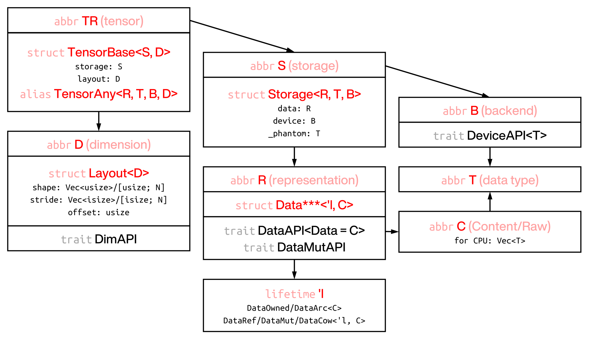

## RSTSR 2nd Report: Understanding and Requirements of Electronic Structure Programs: A NumPy+Rust Perspective

## 1. Preface

Development of electronic structure programs aims to solve or discover scientific problems in chemistry and material structure; but the technical challenges involved are often unrelated to chemistry itself. Electronic structure programs need to take into account both 1) development efficiency and reduced communication cost, and 2) program efficiency and resource control; these are also problems that scientific computing in other disciplines, and even general program development tasks, need to solve.

The Rust language has received good reception in some fields of computer science or its applications. But for scientific computing, Rust rarely has outstanding work; and I believe there is still no consensus on whether Rust is suitable for scientific computing.

The previous [showcase_rust_riccsd](https://github.com/ajz34/showcase_rust_riccsd) work, I believe, can show that for the problems electronic structure cares about, represented by MP$n$ and CC, it is possible to achieve a good balance between development efficiency and program efficiency with appropriate tools. To demonstrate this possibility, I developed RSTSR as a tensor computing tool. Limited by my horizons, abilities and energy, this tool may not be ideal; but I hope to use this tool to show my understanding of and expectations for Rust scientific computing programs, and to provide some ideas for the development of tensor tools that satisfy electronic structure.

This document hopes to use a simple Q&A style to show my understanding of electronic structure program development and the program problems it cares about, as well as my understanding of the Rust language. The second half of this document will introduce the development ideas of the RSTSR program.

A good program tool should allow users to escape tedious technical details to a certain extent, and focus on their own goals; this is also the original intention of developing math library tools. RSTSR is strongly influenced by NumPy. It is necessary for us to show how NumPy or similar math library tools are concretely used in electronic structure, where their strengths and weaknesses are, and our ideas for improving these problems.

This document assumes that GPU heterogeneity and MPI-scale parallelism are not considered. Some conclusions may not apply to these two situations.

<!-- truncate -->

:::info

This document was transcribed from the original typst report to mdx format by AI. The transcription was performed by Deepseek-v4-flash.<br/>**This document is an early document and does not reflect the current RSTSR design architecture or usage.**<br/>**This document contains some radical viewpoints. These viewpoints do not reflect the views of other developers of the REST program.**

:::

## 2. Electronic Structure Problems

### 2.1. As a Scientific Computing Problem, What Are the Characteristics of Electronic Structure?

First, I need to state that my understanding of electronic structure is not complete. I have never written CISD, Full-CI (MCSCF), DMRG, or PBC, and I do not understand the scientific computing challenges of these branches.

Only program implementation issues are discussed here, not method development.

Focusing on problems like MP2, CC and DFT, electronic structure programs
1. are mainly composed of matrix operations or operations and contractions of high-dimensional tensors (generally no more than 4-D, rarely exceeding 6-D);
2. have some problems involving eigenvalue solving or matrix decomposition;
3. have a small number of problems involving nonlinear equation solving (iterative solving of matrix equations).

Corresponding to the above 3 problems respectively, some of my views are
1. Arbitrary-dimension tensor operations and contractions can be classified into two kinds of problems: broadcasted matrix multiplication and broadcasted elementwise operations. This will be explained in detail later, but here we only need to know that these two kinds of problems are relatively standard problems, which can be solved with simple programs and BLAS.
2. Eigenvalue problems and matrix decomposition are standard problems, which can be solved with Lapack.
3. This is not a standard problem, and chemists need to design algorithms according to their own needs. Of course, some matrix equation solvers have solutions in Matlab or SciPy; but their efficiency may not satisfy us.

Therefore, among the above 3 problems, the only one where chemists can truly exert their value is the 3rd kind of problem; the rest are standard problems, which can be implemented by program engineers entirely without chemist participation. Chemists are also not professional at dealing with the 3rd kind of problem, and will very likely need to hand it over entirely to numerical mathematicians.

### 2.2. Why Do Chemists Write Electronic Structure Programs?

The previous answer denied most of chemists' value in writing electronic structure programs. Taking CCSD as an example, apart from DIIS iteration, chemists seem to have no use; after all, for the remaining problems, one just needs to write the program from the formulas. If DIIS was developed by a numerical mathematician, then chemists would not need to do anything.

But chemists still write electronic structure programs, for the following reasons:
- There is no funding or policy support to hire scientific computing programmers. I might think that because we cannot show society and the public that our work has more important value (which may also be the truth), money and resources cannot reasonably tilt toward us. There is no way around this.
- Method development. Chemists are responsible for improving existing methods. Such improvements are usually about accuracy; they sometimes require chemical intuition, and sometimes are a mathematical structure. New methods may need new program tools; the Davidson diagonalization is believed to have come about this way. Therefore, ideally, chemists also need to be engineers and mathematicians. There are also people who improve efficiency (I think Eshuis of the Furche group improving the RPA algorithm is a typical example), but such work is more like the work of mathematicians, and does not really require chemical participation.

But if it is about implementing existing electronic structure methods more efficiently, or in a new program, or writing the gradient properties of existing electronic structure methods, then these have nothing to do with chemistry.

I have also heard more than one person mention that when working with program engineers, they strongly feel that engineers do not understand electronic structure (which produces a certain degree of negative experience). Since I have never worked with engineers, perhaps my following understanding is wrong: in my view, the possible factors causing this communication barrier are
- either the program engineer is limited in ability and cannot correctly understand numerical problems (unrelated to engineers not understanding chemistry);
- or the chemist did not successfully transform the electronic structure problem into a numerical problem (thus the problem lies with the chemist);

Of course, if one person is both a chemist and an engineer, then this communication barrier does not exist.

### 2.3. Does the Early Development of the REST Program Need Chemists?

In my view, no. The main purpose of the early program is to implement existing algorithms (migrating them from other languages or toolchains into REST), which is not chemistry. But an engineer who can understand the language of chemistry is always good.

## 3. NumPy

### 3.1. Why Do You Recommend Chemists to Use NumPy? What Are Its Advantages?

This is a subjective question. Everyone should have their own opinion on what kind of program tools are suitable for chemists.

The programming needs of chemists should generally fall on method development.

The main reasons I recommend NumPy are as follows:
- **Python, the scripting language.** Scripting languages usually have an interactive running mode (bash has shell, python has jupyter, etc.), which is an advantage compiled languages do not have (or at least not conveniently). \
  *But this does not explain why not use Pytorch, Matlab, Mathematica, JavaScript or Julia.*
- **Arbitrary-dimension tensor support and Basic Slicing.** Basic slicing is a means of giving sub-matrices/tensors without copying. This pattern should have started from Fortran, and is not a feature unique to NumPy. \
  *But this does not explain why not use Pytorch, Matlab, Mathematica, JavaScript or Julia.*
- **Support for Einsum.** This is of great help for prototype implementation of post-HF methods. \
  *But this does not explain why not use Pytorch, Matlab, Mathematica, JavaScript or Julia.*
- **Fast matrix multiplication.** NumPy connects to high-efficiency BLAS functions for matrix multiplication, so if the computational bottleneck is in matrix multiplication, NumPy is generally not too slow. \
  *But this does not explain why not use Pytorch, Matlab, Mathematica, JavaScript or Julia.*
- **Relatively complete linear algebra support.** Combined with SciPy, NumPy has solutions for matrix linear algebra, eigenvalue solving, FFT, ODE, extremum problems, etc.\
  *Finally, there are ODE and extremum problems that JavaScript's stdlib does not support, so it is out.*

Among the above 5 factors, the first 3 are decisive factors, all indispensable. But at the same time, you will find that no recommendation reason is unique to NumPy. So it is completely fair to say that recommending NumPy is definitely pushing a personal agenda.

Where NumPy truly has additional advantages over other tools is in
- **Python as a general-purpose language.** This is something Matlab and Mathematica cannot do, and Julia is not good at. JavaScript is more suitable for the frontend.
- **The Python ecosystem.** A larger ecosystem means that if you encounter any problem, others may have encountered it too, and there are public solutions. PyPI and Conda are also important to the Python ecosystem.
- **Convenience of installation and a smaller runtime.** This is relative to Pytorch. Runtime means runtime; here we mean that NumPy as a Python library has a relatively small binary size, and has no extra dependencies besides BLAS.

These additional advantages are not decisive. Moreover, NumPy also has disadvantages; some disadvantages are fatal.

### 3.2. What Are NumPy's Disadvantages?

From my usage experience,
1. **No automatic differentiation.** This is not the most concerning problem for electronic structure programs, but it is indeed one of the most demanded features right now.
2. **No heterogeneous support.** Using only NumPy, one cannot run on GPU. GPU is indeed one of the important directions of scientific computing in the future.
3. **Python loops are slow.** This is well known. For many standard matrix operation problems, we indeed may not need Python for loops; but if we encounter a triangular matrix assignment problem like the following (possibly used for tensor symmetrization $t_{ji}^{ba} := t_{ij}^{ab}$):

   ```py
   for i in range(nocc):
       for j in range(nocc):
           for a in range(nvir):
               for b in range(a):
                   t2[j, i, b, a] = t2[i, j, a, b]
   ```

   There is no suitable NumPy function for this type of operation, which produces quite serious computational efficiency problems. Although it has solutions (Numba jit), it is always not very convenient.
4. **Python iterators are hard to parallelize with threads.** But Python parallelism is only suitable at the process level (multiprocessing), not at the thread level. The above is also an example: the above $t_{ji}^{ba} := t_{ij}^{ab}$ computation can be parallelized with a double loop over the $i, j$ indices. Using fairly standard Python parallel libraries, the effect is a complete mess.
5. **Numba JIT programming is not native Python.** The above two points can be solved with Numba. Numba is not impossible either, but JIT itself takes time, and Numba syntax is not exactly Python; precompiled JIT is also not impossible, but then what is the difference from using the FFI of a compiled language (like C)? JIT programming is not without thresholds: if input and output types are not clearly written, and parallel is not correctly enabled, Numba's acceleration is not good either.
6. **Computation on non-contiguous matrices is very slow and not parallelized.** A typical problem is the closed-shell RI-MP2 $O(n^4)$ energy summation problem. Simplified to a concrete expression, when matrices $\mathbf{A}$ and $\mathbf{B}$ are both c-contiguous or f-contiguous, the operations $2A - A^T$ or $A \odot B^T$ are outrageously slow.\
   Similar problems also appear when calling SciPy. SciPy is usually friendly to f-contiguous matrices; if the input matrix is c-contiguous, it sometimes performs a very inefficient matrix transpose first.
7. **Computation on contiguous vectors is not parallelized.** NumPy does optimize operations on contiguous vectors (SIMD vectorization), but this is mostly work from 10 years ago. 10 years ago, on personal computers, single-threaded operations could generally saturate memory bandwidth; but times have changed, and for some problems a single thread can no longer keep up with memory bandwidth speed. It can be considered that as long as the problem is not matrix multiplication or eigenvalue problems, NumPy has some room for efficiency improvement.
8. **Some function names are quite bad.** For example `np.ix_`; this may be for historical reasons.
9. **Memory control is difficult.** This is related to Python's variable lifetimes. Rust can avoid this problem.

Some of the above problems are also problems encountered by Matlab and Mathematica. The Julia language can combine the advantages of both scripting languages and compiled languages; from this perspective it is indeed a tool more suitable for scientific computing; but the development trend and professionalism of the language itself worry me somewhat.

### 3.3. We Are a Rust Program; Why Mention Python and NumPy?

We are not saying NumPy is good or bad. But we are writing Rust programs and need to use some math libraries. Therefore we need a general understanding of what features math libraries generally have.

From the perspective of scientific computing, NumPy may not be the best choice. But there are reasons to choose NumPy as the baseline for discussing math libraries:
- I am more used to NumPy, and the most popular computational chemistry program in the open-source community right now is PySCF (judging by GitHub stars). Of course there is personal preference involved.
- The Python language that NumPy is based on was not specifically designed for scientific computing. The same is true for C++/Rust in this respect; in contrast are Julia and Fortran. This makes many problems have to be implemented through functions (or operator overloading) rather than through language syntax (e.g., transpose, slicing, matmul, vector solve, inversion).

## 4. Strategies for Rapidly Developing Electronic Structure Programs

### 4.1. Is There a Strategy for Rapidly Developing Electronic Structure Programs? Why Is Rust Not in This Strategy?

As mentioned before, the decisive reasons I recommend NumPy are
- scripting language,
- arbitrary-dimension matrix or tensor support,
- Einsum support.

Of course NumPy is not the only framework suitable for these three points; but since Rust is not a scripting language (REPL language), I would consider it not suitable for rapid development.

Rust is not without REPL frameworks (the evcxr framework), but in my experience compilation is still rather slow.

### 4.2. Is There a Strategy for Rapidly Developing Efficient Electronic Structure Programs?

With the word "efficient" added to this question, the above answer is no longer useful.

The development strategy I have tried in implementing RI-MP2 static polarizability and RI-RHF first-order gradient is
0. Organize the problem into mathematical formulas, avoiding any chemical description as much as possible;
1. Implement it once in NumPy using Einstein summation;
   - This does not mean it can only be implemented with Einstein summation; it is just that for MP$n$/CC tasks, Einstein is absolutely convenient; but there are also other specific problems suitable for other methods. What is meant here is to translate your chemical problem into a program using any framework you find convenient, and execute it correctly. You need to consider what algorithm to use and how to optimize the algorithm, but correctness comes first, and you do not need to consider the actual program efficiency now.
2. In NumPy, split all Einstein summations into (in priority order)
   - matrix multiplication (matmul, matrix multiplication)
   - vector operations (elementwise)
   - operations like summation (reduction)
   - loop unrolling (for loop)
   Finally obtain a Python program completely without einsum.
3. In compiled languages like Rust/C, translate the above logic one by one.

Except steps 0 and 1, the above process is fairly mechanical. To put it harshly, AI-assisted programming may actually be able to replace steps 2 and 3. But for computational performance, the programs of steps 2 and 3 are also important.

From my experience, after step 1 is successfully completed, step 2 for problems at the level of RI-CCSD or RI-MP2 static polarizability takes about 0.5–5 days, and step 3 takes about 1–10 days; the exact time depends on work state, work environment and concentration, and has nothing to do with the creative intensity at the time. The most difficult part of this process is generally step 1, that is, whether the chemical problem can be correctly written as a program and executed within the math library framework we are used to. Of course, this varies with the problem.

## 5. The Relationship between Math Libraries and Electronic Structure

### 5.1. Why Waste Time Developing Math Libraries? Isn't Our Goal to Solve Chemistry Problems?

I would ask in return: why do we use Rust? What is the purpose of giving up the nice scripting languages? Does this really solve chemistry problems?

If one refuses to answer this question, then all the rest of this document is meaningless to the reader. Some situations that seem to answer the question but actually refuse to answer include:
- Our program has already decided to feature Rust.
- C++ is the Sekiro of the programming world; Rust is the Genshin Impact of the programming world. Rust is the pinnacle of abstraction.

I estimate that about 50% of computational chemistry software develops its own math library or binds to external math libraries; some software may even develop two sets, making code reading and communication difficult:
- Q-Chem has developed multiple math libraries internally, including libblas, libmathtools, [libtensor](https://github.com/epifanovsky/libtensor).
- PySCF mainly uses the external math libraries NumPy and SciPy, and also uses TBLIS; but it has its own programs for some operators, generally defined in `np_helper.c`.
- Psi4 has developed its own math library libmints/matrix; judging only from the occ part of Psi4's code, these libraries are mainly used as BLAS wrappers;
- MPQC (as a computational chemistry program that has stopped maintenance) cooperated with other groups on [MADNESS](https://github.com/m-a-d-n-e-s-s/madness) (which is still actively maintained).

I dare not say the reasons for developing math libraries are self-evident, but developing math libraries is indeed the choice of many electronic structure developers.

But there are also many people, especially engineers leaning toward high-performance computing, who probably choose not to use existing math libraries. They may need a more flexible program writing style, using at most low-level programs like BLAS or FFT, without heavily using high-level interfaces.

The significance of math libraries is somewhat subtle. In my view, its purpose is: **balancing development efficiency and program efficiency**.
- For the highest development efficiency, one should generally use scripting languages Python, Matlab, Julia;
- For the highest program efficiency, one should generally directly call low-level BLAS and hand-write some functions.

Therefore, the general requirements for math libraries are
- implement important operators to satisfy general numerical computation needs;
- for the implemented operators, the implementation efficiency should approach the ideal limit;
- the code should be simple and intuitive enough, and not easily misused by users.

Even though the significance of math libraries is subtle, I still think it is necessary to use math libraries in computational chemistry programs. Different people have different judgments on this matter; so this statement can be seen as my philosophical proposition, not necessarily rational. In my previous implementation of RI-MP2 static polarizability, my workflow was to first draft it with NumPy, then implement it in C; it took about a week in total. The C part was mainly implemented by calling BLAS. But calling BLAS is error-prone: it is easy to make mistakes in writing matrix dimensions and leading dimensions without the program reporting errors; such code is also not intuitive. Therefore, to write efficient and correct code faster, I am motivated to develop math libraries.

### 5.2. Implementing a Math Library Is Too Much Work; Can We Design a Math Library with Electronic-Structure-Specific Features?

I hold a negative position on this question.

The needs that electronic structure has for math libraries already cover the functionality of most math libraries (represented by NumPy). A math library that satisfies electronic structure needs can generally also satisfy the needs of other disciplines.

The specific requirements electronic structure may have for math library features will be discussed later.

For the difficulty of math library development, I think using an unsuitable or inconvenient framework to develop programs is also a time cost, and developing a framework is also a time cost. It is hard for me to evaluate which one takes more time, but the latter indeed gives people the impression of having done nothing, and of not knowing at which specific step the electronic structure method was not implemented. In fact, other developers besides myself, and non-developer classmates, also cannot endorse developing a math library, because it looks very difficult; and with PyTorch being so powerful now, the marginal benefit of doing this seems lower and lower. Only when the shortcomings of NumPy itself are solved, the advantages of Rust as a newly developed compiled language are endorsed, the developed library is satisfactory in both convenience and performance, and the features are relatively complete, can developing a new math library have positive returns; and even so, it cannot directly compete with PyTorch's features and ecosystem.

### 5.3. Why Not Consider Using PyTorch's Rust Binding?

PyTorch is almost the best math library framework at present, even without considering its more powerful automatic differentiation. I also deeply respect the author of PyTorch's Rust binding crate `tch-rs`; this is absolutely not a simple binding, it is itself a very good solution for a Rust math library.

I think the following factors are not necessarily decisive, but combined I tend not to use PyTorch's Rust binding crate `tch-rs`:
- PyTorch's runtime is too large, and users may have linking problems (CPU-only is somewhat better); it may be difficult to run on some devices; a pure-Rust framework can reduce these dependencies, at least down to only needing BLAS (and CUDA later if GPU support is added). It is better to treat PyTorch as an optional backend rather than binding to this one framework.
- The crate `tch-rs` is already quite powerful as a libtorch binding and a native Rust interface; but it is still a foreign library, and we cannot fully expect to smoothly add features to it for electronic structure purposes.
- Getting data in and out of `tch-rs` tensors currently seems possible only by copying. Rust's standard containers for data are either `Vec<T>` or `&[T]`, and producing or extracting data has no overhead; but `tch-rs` hands the data completely over to the C++ part, and the Rust part no longer has control over the data, so if you want to perform operations on the data outside `tch-rs`, there is great overhead.
- `tch-rs` does not seem to be actively maintained, but it keeps updating PyTorch versions and dependencies to stay usable (or the library may already be in a completed state and needs no updates). The focus of `tch-rs` developer ([Laurent Mazare](https://github.com/LaurentMazare)) is now the candle library, but candle seems even further from electronic structure.
- Following the above two reasons. I think the reason the author later developed candle is that PyTorch's operators are not necessarily up-to-date in the LLM era; but writing new operators in the PyTorch backend is not convenient unless done in C++; to keep up with LLM development in a framework different from PyTorch, a new machine learning framework was needed. Of course, this is not our concern, but it means that using `tch-rs` sacrifices considerable flexibility.
- It is not impossible on the `tch-rs` framework, but support for complex floating point numbers is currently basically zero.

### 5.4. Why Not Consider Using Other Math Libraries in Rust?

Other Rust math libraries are not unusable either, but I hope to do better. Also refer to [RSTSR Features](#rstsr-pro) later.

But I also want to say that when I first started with Rust, my mindset was that others wrote math libraries ten years ago, so we might as well use theirs. I held this attitude for a long time, until I could not conveniently use the ndarray framework to achieve a program efficiency satisfactory to me on the RHF first-order gradient problem; and the RHF first-order gradient problem ideally needs three-dimensional tensor support and indexing support close to basic slicing, and rest_tensors is also not very suitable.

I hope that my mindset in developing a Rust math library is not the [Not Invented Here effect](https://en.wikipedia.org/wiki/Not_invented_here). Therefore, I want to use this document to fully state my understanding of the relationship between math libraries and electronic structure, to determine what exactly we want, and why I am not satisfied with existing tools.

### 5.5. What Math Library Features Do Electronic Structure Programs Need? {#how-elec-needs-num}

We answer this question in reverse. What features do math libraries generally have? Which of them will be used by electronic structure programs?

After the explosion of Python math libraries in 2016–2017 with the popularity of machine learning, starting from 2020 the community formed the [Python array API standard](https://data-apis.org/array-api/latest). Although this standard is not mandatory, NumPy 2.0 enabled it; and this standard helps us understand the expectations and basic requirements of general users and developers for math libraries.

The main content of the Python array API standard is in the [API specification](https://data-apis.org/array-api/latest/API_specification/index.html). The main parts are

- **Array object**: the definition of arbitrary-dimension dense tensors (including 0-D scalars), and basic operations such as addition, subtraction, multiplication and division.
  - CCSD computation needs the double excitation tensor $t_{ij}^{ab}$; various energy and gradient computations need 3c-2e ERIs like $Y_{ia, P}$ or their Cholesky decomposition; MP2 gradient computation often needs to store three of the dimensions of $t_{ij}^{ab}$. Generally speaking, computational chemistry has a rigid need for 3-D tensors, and 4-D tensors are also often needed. Meanwhile, gradients often have three-dimensional tensors like $h_{\mu\nu}^{t} = \langle \mu | t | \nu \rangle$ (where $t$ represents the three components $x, y, z$); although it can indeed be stored as a Vector of three 2-D matrices, storing it directly as a 3-D tensor is generally more convenient.

- **Broadcasting**: the broadcast computation of tensors. Its rules are quite complex, but the actual applications are two cases:
  - Direct sum or direct product. In MP2 or CCSD energy computation, one encounters the need for a matrix $\Delta_{ab}^{ij}$ (a 2-D matrix only about the indices $a, b$; the indices $i, j$ are generally used in the outer loop), which needs to be computed by:

    ```py
    d_ab = e_occ[i] + e_occ[j] - e_virt[:, None] - e_virt[None, :]
    ```

    This is a standard direct sum computation. It uses both broadcasting and the basic indexing trick of adding a dimension (unsqueeze / newaxis).
  - Operations of matrices with different dimensions. This is the original purpose of broadcasting, not used much in chemistry; but for the cases where it can be used, broadcasting is very convenient. For example, handling the multiplication of gradient matrices and density matrices:

    $$
    \partial_{A_t} E \leftarrow - \sum_{\mu} \sum_{\nu \in A} h_{\mu\nu}^{t} D_{\mu\nu}
    $$

    Letting the variable `slc` be the set of basis functions on atom $A$ (we are now discussing programs based on atomic orbitals),

    ```py
    de[atom, :] -= (deriv_h[:, :, slc] * rdm1[:, slc]).sum(axis=(-1, -2))
    ```

    The above computation uses elementwise multiplication of a 3-D and a 2-D matrix, which is broadcasting multiplication.

- **Creation Functions**: tensor creation functions. Empty tensors, zero tensors, identity matrices.

- **Data Types**: this is not a concrete function, but requires the tensor library to at least handle 8–64 bit integers and unsigned integers, 32–64 bit floating point numbers and complex floating point numbers, and boolean types.

- **Element-wise Functions**: operation functions. This includes common functions like abs, sin, log, greater, floor, isnan. Actually many functions are not used in chemistry, but they are still needed to handle the needs of methods like Laplace-Transform for these functions. Determining electron occupation numbers often requires magnitude comparisons.

- **Indexing**: arbitrary-dimension indexing, generally referring to NumPy's basic indexing, but the Python array API standard also requires boolean tensor indexing. Computational chemistry has needs for both basic indexing and boolean tensor indexing (or similar index-list indexing):
  - In the two code cases of broadcasting, the direct sum computation of $\Delta_{ab}^{ij}$ needs newaxis indexing (adding a dimension via indexing); the computation of $\partial_{A_t} E$ is standard indexing that extracts part of the contiguous atomic orbitals.
  - Some special frozen orbital, or CAS, or MOM orbital selections are implemented by indexing with a list of indices. Suppose we want to obtain the [1, 2, 3, 5, 6] orbitals of the system,

    ```py
    frz_orbs = [1, 2, 3, 5, 6]
    frz_coeff = mo_coeff[:, frz_orbs]
    ```

- **Linear Algebra Functions**: matrix multiplication, matrix transpose, tensor contraction, vector inner product. We generally use the first two, and the importance of the first two is self-evident; tensor contraction is implemented by tensordot, which is also a frequently used feature, but at the cost of code readability or convenience it can be replaced by matrix multiplication.

- **Manipulation Functions**: common functions include reshape for changing shape, permute_dims (transpose) for tensor transposition, and stack and concat for stacking or concatenating matrices. reshape is a very commonly used and important function.

- **Searching Functions**: argmax/argmin, nonzero, where. We do not use these functions much.

- **Set Functions**: convert tensors to sets (set, in the programming context). We do not use these functions.

- **Sorting Functions**: sorting functions. Not used much in electronic structure, but may be used in the future.

- **Statistical Functions**: max/min, sum, prod, std, etc. We need to use sum often.

In summary, **electronic structure has comprehensive needs for math libraries**. Except the three categories Searching, Set, Sorting, we need all the rest.

In addition, there are many features that math libraries may not have, but are of important use in computational chemistry:

- **Matrix decomposition.** This is part of Lapack; its significance is self-evident.

- **Special operators or einsum.** einsum is not within the scope required by the Python array API standard, but it is of great help to electronic structure. Many DFT computations are inefficient under standard operators; one either needs to implement a powerful einsum, or manually implement these operators (like the current rest_tensors and PySCF).

- **Nonlinear matrix equations.** This refers to solving $f(\mathbf{x}) - \mathbf{b} = \mathbf{0}$; but note that although $f(\mathbf{x})$ can be written as $\mathbf{A} \mathbf{x}$, due to computational difficulty or excessive storage, $\mathbf{A}$ will not be directly computed, so $\mathbf{x}$ needs to be implemented by solving equations. The typical problem of this kind is the CP-KS equation, and of course also similar Casida equations or wave function stability analysis. These problems may be problems that SciPy cares about, or may require us to implement the algorithms ourselves.

## 6. Understanding of Performance, Understanding of Rust

### 6.1. How Do You View Rust?

Rust is a new language; even general programmers have less exposure to it and find it difficult to learn, not to mention computational chemistry programmers. Migrating the workflow to Rust generally means that C++, Fortran, Python or Matlab cannot satisfy us in some situation, and this dissatisfaction is not easily compromised:
- Matlab is commercial software and not a general-purpose language;
- Python has defects in performance and parallelism, and memory control is difficult; Python's MPI is not convenient;
- C++ is not impossible, but it is not easy to write code that correctly conforms to program standards, and we currently do not have senior architects; C++ project organization is not as convenient as Python's PyPI or Rust's Cargo; C++ templates and macros are too flexible, easily producing hidden compilation problems, and IDEs cannot correctly recognize some syntax.
- C is not a high-level language, and problems like compiling correctly but failing at runtime, segmentfaults, etc., easily occur;
- Fortran has similar problems to C in its low-level parts, and as a high-level language it is not as good as C++.

Rust indeed solves most of the above problems well; there are still some regrets in actual experience, but most regrets are not decisive.

One of the important reasons to choose Rust, I believe, is its higher performance. The most important reason for abandoning Python in favor of Rust is generally performance; the secondary reason is that Python's overly flexible program framework makes it easy for novice programmers to write code that does not conform to program standards, polluting the codebase. Therefore, in my view, for people who use Rust and abandon Python (for me, as someone who moved out of the comfort zone of the Python workflow to Rust), **performance is non-negotiable**, at least one cannot make great concessions in performance for higher development efficiency. Otherwise why not use Python.

I did try to write the Rust math library RSTSR. One of the important factors is the hope to advance the development efficiency of electronic structure programs in Rust. But this is advancing development efficiency based as much as possible on fast program performance, not the other way around.

### 6.2. How to Evaluate and Improve Computational Performance?

Although Rust is said to have higher performance, it must be pointed out that
1. C/C++/Julia, as compiled languages, generally also have higher performance.
2. Language is not the only factor determining performance. Even with the same algorithm, the way the program is written (techniques) also determines program performance.

To avoid falling into agnosticism (making the discussion ineffective) when discussing program performance, it is necessary to state here that program performance has its evaluation strategy. This generally has nothing to do with Rust; as long as it is a language with a relatively powerful compilation backend (like GNU, LLVM), the discussion here applies.

Most of the understanding here took shape from implementing the CNN Winograd algorithm. The CNN Winograd algorithm is a very interesting example: it is both compute-intensive and requires heavy bandwidth usage; and to improve computational efficiency, assembly language (or instruction set functions close to assembly) is needed. The content discussed below is reflected in [this document](https://ajz34.readthedocs.io/zh-cn/latest/ML_Notes/winograd6x3/cnn_winograd_l2.html).

1. **The premise of pursuing performance is an efficient algorithm.** Algorithm has two meanings:
   - **Algorithm complexity.** A typical example is the MP2 4c-2e AO2MO problem:

     $$
     g_{ij}^{ab} = \sum_{\mu\nu\kappa\lambda} C_i^{\mu} C_a^{\nu} g_{\mu\nu}^{\kappa\lambda} C_{\kappa}^{j} C_{\lambda}^{b}
     $$

     If no optimization is done and the above formula is computed directly, an 8-fold loop would be written (because there are 8 indices $i j a b \mu\nu\kappa\lambda$), and each iteration does 4 multiplications and 1 addition, so the FLOPs of the above formula is $5 n_{\text{occ}}^2 n_{\text{vir}}^2 n_{\text{basis}}^4 \sim O(N^8)$ (i.e., 8th-power complexity). But in fact, without any approximation to the above formula, the same result with no error can be obtained with less computation:

     $$
     g_{ij}^{ab} = \sum_{\lambda} C_{\lambda}^{b} \sum_{\nu} C_{a}^{\nu} \sum_{\kappa} C_{\kappa}^{j} \sum_{\mu} C_{i}^{\mu} g_{\mu\nu}^{\kappa\lambda}
     $$

     This requires only 4 $O(N^5)$ operations (i.e., 5th-power complexity), greatly simplifying the computation time.
   - **FLOPs, the floating point operation count.** A simple example: for square matrices $\mathbf{A}, \mathbf{B}, \mathbf{C}$ of length $n$,

     $$
     \mathbf{A}\mathbf{C} + \mathbf{B}\mathbf{C}
     $$

     The FLOPs of this expression is $4 n^3$. But if we combine like terms to get $(\mathbf{A} + \mathbf{B})\mathbf{C}$, the computation can be halved to $2 n^3$. It does not reduce the complexity below cubic, but the performance improvement is still great. This looks like a very simple conclusion, but this method is of great help when dealing with the $O(n_{\text{occ}}^3 n_{\text{vir}}^3)$ terms of RI-CCSD. There is also a class of problems that can reduce computation using symmetry, such as RI-JK integrals, RI-MP2 energy summation, the pp-Ladder term computation of CCSD, etc.

   The above discussions do not involve concrete programs or concrete code techniques, but they are the most critical performance improvement factors. **Before using code techniques to accelerate a program, one should as much as possible explore the possibility of improving the algorithm and the FLOPs.**

2. **Determine the FLOPs or bandwidth usage.** Most electronic structure problems, especially those not exploiting sparsity and locality, can have their FLOPs given strictly. This does not mean computing exactly correctly, but at least estimating without deviating more than 10%.\
   Taking the $O(n_{\text{occ}}^3 n_{\text{vir}}^3)$ terms of RI-CCSD as an example,

   $$
   \begin{aligned}
   I_{kldc}^{(1)} &= \sum_P B_{kd}^{P} B_{lc}^{P} \\
   I_{ikca}^{(2)} &= \sum_{ld} I_{kldc}^{(1)} t_{il}^{da} \\
   I_{ikca}^{(3)} &= \sum_{ld} I_{kldc}^{(1)} t_{il}^{ad} \\
   I_{ikca}^{(4)} &= \sum_P \left(B_{ik}^{P} + \sum_c B_{dk}^{P} t_i^{d}\right) \left(B_{ac}^{P} - \sum_l B_{lc}^{P} t_l^{a}\right) \\
   t_{ij}^{ab} &\leftarrow \sum_{kc} \left(I_{ikca}^{(2)} - I_{ikca}^{(3)} - I_{ikca}^{(4)}\right) t_{jk}^{cb} \\
   t_{ij}^{ab} &\leftarrow \sum_{kc} \left(\frac{1}{2} I_{ikcb}^{(2)} - I_{ikcb}^{(4)}\right) t_{jk}^{ca}
   \end{aligned}
   $$

   The above has 6 lines of formulas, but the computation of $I_{kldc}^{(1)}, I_{ikca}^{(4)}$ is actually negligible; the remaining four lines are each $2 n_{\text{occ}}^3 n_{\text{vir}}^3$ FLOPs, so the total computation of this process is estimated to be $8 n_{\text{occ}}^3 n_{\text{vir}}^3$. Is the rest unimportant? Not very. Looking carefully, $I_{kldc}^{(1)}$ can exploit symmetry, so the FLOPs of $I_{kldc}^{(1)}, I_{ikca}^{(4)}$ are about $3 n_{\text{occ}}^2 n_{\text{vir}}^2 n_{\text{aux}}$; its ratio to the computation of the other 4 lines is about $1 / n_{\text{vir}}$, i.e., when the number of virtual orbitals is greater than 10, the computation of $I_{kldc}^{(1)}, I_{ikca}^{(4)}$ can be ignored.\
   The above formula also has some memory bandwidth usage, reflected in the computation of $\left(I_{ikca}^{(2)} - I_{ikca}^{(3)} - I_{ikca}^{(4)}\right)$. Note that for a computing device with one NUMA node and 16 cores CPU, the typical bandwidth and performance limits are 10 GB/sec (1.2 G doubles/sec) and 1 TFLOP/sec respectively. If the FLOPs and the memory bandwidth demand differ by more than 800 times, then memory bandwidth is not the decisive factor. In the current problem, if $n_{\text{occ}} n_{\text{vir}} > 800$, then memory bandwidth no longer matters either. Nevertheless, memory bandwidth analysis is still important in some specific memory-intensive problems (like DFT computation), or in MPI communication.

3. **Determine the performance limit of the computing device.** Program performance optimization always has an upper bound; this upper bound is not unknowable either. By running the [bandwidth64](https://zs3.me/bandwidth) program in parallel, one can generally evaluate the computation and communication efficiency of the L1, L2, L3 caches of the computing device. Intel OneAPI Advisor can also provide valuable data. Generally speaking, current CPUs usually have 70 GFLOP/sec/core (depending on the CPU frequency and the number of AVX channels), and the bandwidth is 16 GB/sec/socket (which should depend on the motherboard and the CPU PCIe). For this part of the information, one can also refer to the previous evaluation document of the HiSilicon Kunpeng device performance. GPU computational performance parameters are generally more transparent than CPU, and can be looked up directly in the official manuals.

4. **Compare the device limit and the actual program's floating point efficiency FLOP/sec.** Taking the [RI-CCSD Rust demonstration case](https://github.com/ajz34/showcase_rust_riccsd) as an example, we can determine that the most time-consuming part averages about 45% utilization of the device performance limit (around 500 GFLOP/sec on a 16-core CPU device). Generally speaking, a program efficiency of 50% of the device performance limit is satisfactory:
   - On the one hand, high-performance BLAS achieves only 60%–80% utilization, and further optimization hardly leaves room for improvement;
   - On the other hand, computational chemistry currently has low output value and is usually exploratory research; invalid computation and inefficient usage scenarios are common, so it is acceptable as long as the efficiency is not unbearably low (about 50% extra efficiency loss, i.e., 20% of the device performance limit);
   - Moreover, part of electronic structure tasks are iterative; more iteration steps are themselves performance loss, so pursuing extreme performance also includes pursuing better numerical iteration algorithms.

   For Python-based programs, considering only the single-node situation, the efficiency is often tolerable in many cases; but there are also many cases where Python and NumPy step on the intolerable low-efficiency red line (this is somewhat why PySCF has so much C code patching).

### 6.3. As Chemistry Programmers, Do We Need to Manually Tune Performance?

Generally speaking, **we should not**. Chemists, including program engineers working in chemistry, should not waste energy on the showmanship of program optimization, but should let the program return to its essence as a "formula translator". The premise of this statement is that the algorithm has already been designed by chemists and engineers.

Everyone's energy is limited; if everyone can handle their own work well, efficiency will improve quickly. We chemists had better hand over the "formula translator" work entirely to professional numerical program architects, and focus on our own work. But this also means that the "formula translator" itself must be good enough, and professional numerical program architects must be able to do their own work well, for us to use it conveniently.

As a more detailed explanation, the main FLOPs consumption of electronic structure programs is in matrix multiplication; and matrix multiplication is generally provided by BLAS, which we have no ability to manually tune. For the rest, slightly worse performance is acceptable, but like Python and NumPy it is still not very satisfactory. So the room for us to manually tune performance is actually not large; for the three-level caches, pipeline streaming, and prefetching that high-performance computing cares most about, we treat them all as if they did not exist; we write some parallelism when appropriate. This approach is generally fine on CPU, but GPU may need further discussion.

But specifically, this question depends on how "manual performance tuning" is defined, and under what toolchain the tuning is done.

- One extreme case is that I say I like np.einsum (or equivalent tensor contraction tools in other libraries), and I do not allow more complex expressions. But considering that current tensor contraction tools cannot reach limit efficiency (though it must be admitted that many tensor contraction tools can now achieve ideal efficiency, at least higher than 20% of the limit performance); and some expressions written as Einstein summations may not be suitable for combining like terms, which indeed increases computation time; then manually splitting Einstein summations and combining like terms is necessary.
- A more common but hidden case is that we may encounter non-contiguous dimensions. For example the following problem:

  $$
  \mathcal{T}_{jbP} = \sum_{ia} B_{iaP} I_{ijab}
  $$

  Although this problem can indeed be implemented by splitting into GEMM (so Einstein summation may also have considerable efficiency):

  ```py
  # T: jbp, B: iaP, I: ijab
  T = np.zeros([nocc, nvir, naux])
  for j in range(nocc):  # can be parallel
      for i in range(nocc):  # can be parallel, but with reduce
          T[j] = I[i, j].T @ B[i].T
  ```

  But if $I_{ijab}$ is not stored in the order $i, j, a, b$, but rather as $I_{iajb}$, then not only is the program more efficient, it can also be done with shorter and clearer code logic:

  $$
  \mathcal{T}_{jbP} = \sum_{ia} B_{iaP} I_{iajb} \quad \Rightarrow \quad \mathcal{T}_{jb, P} = \sum_{ia} B_{ia, P} I_{ia, jb}
  $$

  ```py
  # T: jbp, B: iaP, I: iajb
  T = I.reshape([-1, nocc * nvir]).T  @ B.reshape([-1, naux])
  T.shape = [nocc, nvir, naux]
  ```

  Therefore, before generating the four-dimensional tensor $\mathbf{I}$, we should already consider whether it is more suitable to store it as $I_{ijab}$ or $I_{iajb}$. More extreme problems may not even be expressible with GEMM in any way (an explicit transpose must be performed to convert to a GEMM problem), such as $\mathcal{T}_{Pca} = \sum_b B_{abP} f_{bc}$ — such tensor storage patterns must be avoided.\
  This type of problem must be considered when writing programs, but it is not something chemists themselves should care about. The "formula translator" itself is only responsible for translating formulas correctly, not for what is the most efficient arrangement of tensor indices. This kind of problem is in the gray zone between chemists and the "formula translator", and needs to be solved by the engineers implementing electronic structure methods.
- Whether the toolchain is mature, efficient, and whether there are problems specific to computational chemistry, are also factors to consider. Math library quality is not high; although this is nominally the responsibility of numerical program architects, chemists may need to lend a hand because there is no one else. Take NumPy as an example here.
  - Apart from fast matrix multiplication, NumPy's other operations are inefficient; this caused PySCF to spend considerable effort on DFT-related grid integration problems in C. This is partly NumPy's own problem (it cannot parallelize vector operations well). Early NumPy's matrix multiplication probably had problems too; PySCF's `np_helper.c` has had to clean up after NumPy quite a lot.
  - NumPy does not provide a GEMM interface itself; for complex matrix $\mathbf{C} = \mathbf{A}^{\dagger} \mathbf{B}$ multiplication, one has to call SciPy to solve it (this problem is also not easy to solve in the current RSTSR framework in Rust). So whether to call `a.conj() @ b` or `scipy.linalg.blas.gemm`, and whether the matrix fed to SciPy has been transposed to f-contiguous, these fine-grained tricks indeed affect program efficiency to some extent.
  - We often store symmetric matrices as lower triangular matrices (c-contiguous) or upper triangular matrices (f-contiguous); but when actually using them, they need to be expanded to symmetric matrices. This feature is frequently needed in chemistry, and many mainstream math libraries do not support this type of feature well. Expanding such packed matrices is fine to implement in compiled languages, but implementing it in Python is inappropriate; therefore chemists must develop program tools to solve this kind of problem.

### 6.4. I Cannot Trust Math Library Performance for Some Problems; Should I Write My Own Operators?

My answer is that at present it is likely still necessary; but this depends on the completeness of the math library.

I do not deny that some math libraries have very bad efficiency on some simple operation problems. Not being able to trust math library performance is completely understandable. I cannot give a firm answer to this question.

But I also think that on many simple standard problems, it is reasonable for math libraries to have good performance. This should not be left to users. Bad math library performance is the math library's problem; as users, we only need to clean up their mess because there is no way around it.

There are also many non-standard problems, especially in machine learning where operator fusion was a hot topic for a while; such problems can usually be reduced to standard problems, but with the necessity of performance optimization or numerical stability optimization (a typical example is softmax). Such problems should have first been solved manually by machine learning deployment engineers; but later PyTorch solved the problems by throwing manpower at operators.

In electronic structure problems, especially the CC/MP$n$ class of problems, everything is matrix multiplication, elementwise multiplication or addition, and summation problems. Such problems are very standard, and there are rarely special computation patterns. Even non-standard problems are usually not FLOPs bottlenecks.

Matrix multiplication should trust BLAS libraries. Even using MKL on AMD CPUs, we can absolutely never write anything faster than BLAS. As a compute-intensive algorithm that is unfriendly to cache access, the concrete algorithm of matrix multiplication is not only complex, but requires very subtle tricks. Besides the complex five-fold loop exploiting the three-level caches (the batch of the loop depends on the L1/L2 cache of the current computing device), it also needs assembly language combined with pipeline streaming and prefetching for the corresponding CPU microarchitecture; this is no longer a problem we should understand. As an introduction (I have not fully understood it either), please refer to the [tutorial of R. van de Geijn](https://www.cs.utexas.edu/~flame/laff/pfhp/), the postdoc advisor of Kazushige Goto (K. Goto) and Devin Matthews.

But many DFT problems, although they can also be implemented with efficient math library functions, may be better without the math library. DFT's performance bottleneck is different from those of HF and post-HF; although two of its steps are GEMM matrix multiplication problems:

$$
F_{\mu\nu} \leftarrow \int w_{\mu}(\mathbf{r}) \varphi_{\nu}(\mathbf{r}) \mathrm{d}\mathbf{r} \quad \Rightarrow \quad F_{\mu\nu} \leftarrow \sum_g w_{\mu g} \varphi_{\nu g}
$$

and the basis transformation problem of orbitals on grid points:

$$
\varphi_i(\mathbf{r}) = \sum_{\mu} C_{\mu i} \varphi_{\mu}(\mathbf{r})
$$

Apart from these two GEMM problems, the other problems are usually not GEMM problems; they are usually bandwidth bottlenecks, but also occupy considerable computation time. Among such problems, some can be efficiently implemented in NumPy with np.einsum, but np.einsum cannot guarantee high efficiency on all problems.

#### 6.4.1. An Operator Case Not Suitable for Trusting the Math Library: $C_g = \sum_i A_{ig} B_{ig}$

A typical problem is the generation of the SCF density on grid points:

$$
\rho(\mathbf{r}) = \sum_{\mu\nu} D_{\mu\nu} \varphi_{\mu}(\mathbf{r}) \varphi_{\nu}(\mathbf{r})
$$

One step of this problem can be reduced to the following numerical problem (based on some algorithms, matrix $A$ can be equal to matrix $B$, further saving bandwidth):

$$
C_g = \sum_i A_{ig} B_{ig}
$$

This step can be implemented in a standard way in a math library:

$$
T_{ig} = A_{ig} B_{ig} \quad \text{or} \quad \mathbf{T} = \mathbf{A} \odot \mathbf{B}
$$

$$
C_g = \sum_i T_{ig} \quad \text{or} \quad \mathbf{C} = \text{sum\_row}(\mathbf{T})
$$

Written as NumPy code:

```py
t = a * b
c = t.sum(axis=0)
```

Of course, the above code can also be abbreviated as `c = (a * b).sum(axis=0)`. Such an algorithm is of course correct, but the cost is generating a temporary tensor $T_{ig}$. The extra memory needed for this temporary tensor is a small matter (because DFT should generally control the number of batched grid points); but the extra write and read of $T_{ig}$ is a waste of computing resources.

Next, we will use a concrete example to show and compare the computational efficiency of different math libraries and different implementations. For the current problem, the number of orbitals (index $i$) is set to 1000, and the number of grid points (index $g$) is set to 100,000.

We first consider the optimal solution of this code. In Rust, directly computing with a brute-force loop:

```rust
let vec_c: Vec<f64> = vec![0.0; ng];
vec_c.par_iter_mut().enumerate().for_each(|(g, c)| {
    for i in 0..ni {
        *c += vec_a[i * ng + g] * vec_b[i * ng + g];
    }
});
```

This computation takes 31 msec. Note that matrices $\mathbf{A}, \mathbf{B}$ each have a memory size of 0.75 GB; traversing these two matrices alone takes about 15 msec; therefore the above implementation reaches at least 50% of the limit bandwidth performance. I cannot yet determine whether there is a faster implementation for the above computation. PySCF has a slightly different algorithm for this problem (the C function [`VXC_dcontract_rho`](https://github.com/pyscf/pyscf/blob/4e2b9603e3850e9a61118a4bc8c7973c5588c251/pyscf/lib/dft/nr_numint.c#L222-L245)), which takes 29 msec. I think taking 30 msec as a reference is reasonable.

Do not think that because the fastest for this problem is only 30 msec, it does not need attention. On the one hand, there are quite a few similar processes in DFT computation; on the other hand, if this function is not implemented well, it can take seconds, as will be seen below.

NumPy actually has another tool for this kind of problem: np.einsum:

```py
c = np.einsum("ig, ig -> g", a, b)
```

This function actually has very good performance on the current problem, taking about 36 msec. Moreover, this function runs completely single-threaded, meaning it likely has very strong SIMD optimization but is not parallelized. Due to the characteristics of the current problem, not parallelizing can still achieve good efficiency; but not every problem is like this, and np.einsum will show its disadvantages on other problems.

If we cannot use np.einsum, but use ordinary tensor library logic, then for NumPy:

```py
# numpy                       #  100 msec in total
t = a * b                     #   79 msec
c = t.sum(axis=0)             #   21 msec
```

For Rust's RSTSR:

```rust
// RSTSR                      // 127 msec in total
let t = &a * &b;              //  97 msec
let c = t.sum(0);             //  31 msec
```

For Rust's ndarray:

```rust
// ndarray                    // 340 msec in total
let t = &a * &b;              // 308 msec
let c = t.sum_axis(Axis(0));  //  21 msec
```

For Rust's nalgebra:

```rust
// nalgebra                   // 410 msec in total
let t = a.component_mul(&b);  // 343 msec
let c = t.row_sum();          //  70 msec
```

Although NumPy and RSTSR have considerable efficiency, they are in any case 3–4 times slower than the most efficient code. Therefore, for the current $C_g = \sum_i A_{ig} B_{ig}$ problem, to achieve efficiency, it is very likely necessary to implement it in the Einstein summation framework or to hand-write the function, and it cannot be implemented with ordinary matrix multiplication, vector elementwise operations, summation and other basic operators.

### 6.5. Which Rust Features Are Unsuitable for Building Math Libraries?

- **Rust is not a language focused on scientific computing.** Things like transpose, inversion, etc., can neither be replaced by symbols (operators) nor implemented in the language standard library; even complex number operations require external libraries.

- **Rust is difficult to implement syntactic sugar with symbols.** Some operator-corresponding traits in Rust are hard-coded; this causes functionality that can be concisely implemented with operators in NumPy to have to be implemented with functions in Rust, greatly increasing syntactic noise. For example,
  - **Indexing.** In NumPy, `a[1, 2:4, 3:10]` can index a three-dimensional tensor to a two-dimensional matrix; this indexing is done through the operator `[]`. Rust also has the operator `[]`, but it is done through the Trait `Index`:

    ```rust
    pub trait Index<Idx>
    where
        Idx: ?Sized,
    {
        type Output: ?Sized;

        // Required method
        fn index(&self, index: Idx) -> &Self::Output;
    }
    ```

    Its output is `&Self::Output`, not `Self::Output`! This means you cannot only return an existing variable, but cannot return some created quantities. We will discuss later that the raw data of an indexed tensor is indeed unchanged, but new shape information and offset are produced; these need new memory space to store. Therefore, the return value of tensor indexing is in any case very difficult to store with a reference type `&Self::Output`. Thus, for tensor indexing in Rust, unless you just want to take out a value, which can be done with the Trait `Index` or the equivalent operator `[]`; otherwise, if you want to index out a sub-tensor, you still have to honestly use a function. In the candle framework this function is `.i()`, in ndarray it is `.slice()`; in RSTSR, `.i()` and `.slice()` are equivalent.
  - **Assignment.** C++'s symbol overloading is so powerful that C++ tensor contraction libraries can do wonders with the operator `=`. But Rust is the other extreme: `=` only has assignment functionality and cannot be overloaded. This may be designed for Rust's lifetime guarantees, but it is very unfriendly to us scientific computing users. The simplest example is assigning to an indexed tensor:

    ```py
    c[:, :nocc] = a[:, :nocc]
    ```

    Such code is very intuitive in Python, but Rust does not allow assignment to a statement. In Rust's RSTSR, although this is not unsolvable, it still goes around in circles or adds syntactic noise:

    ```rust
    // by assign
    c.i_mut((.., ..nocc)).assign(a.i((.., ..nocc)));
    // if c is zeroed before assignment, use add_assign is also valid
    let mut c: Tensor<f64> = rt::zeros(([nao, nmo], &device));
    *&mut c.i_mut((.., ..nocc)) += a.i((.., ..nocc));
    ```

    Please note that the Trait `AddAssign` in Rust is overloadable, so the above problem has two solutions. I personally prefer the second one; since it can use the `+=` symbol, it is more like Python code, but it has a performance cost. The same is true for ndarray.
  - **Comparison.** Taking the function `eq` as an example, in the standard library's `PartialEq`,

    ```rust
    fn eq(&self, other: &Rhs) -> bool;
    ```

    Its return type is hard-coded to boolean. But in NumPy, code like this

    ```py
    c = a == b  # returns a tensor of boolean type, not bool itself
    c = a is b  # this returns boolean, but comparing id(a) and id(b)
    ```

    especially the first line above, must in Rust be implemented through other functions rather than symbols.

- **Rust adds syntactic noise due to its ownership mechanism and error handling mechanism.** This problem is also discussed in the standard library; refer to the [`Vec::try_with_capacity(_in)` issue](https://github.com/rust-lang/rust/issues/91913#issuecomment-2209392254). This is an indirect rather than direct consequence. Rust's ownership and error handling mechanisms are actually its advantages; but as a library developer, when you start writing functions, you will find that you need to write at least 4 cases. Taking `transpose` as an example:
  - the function `into_transpose_f` taking values in and out and allowing error handling;
  - the function `into_transpose` taking values in and out and panicking directly on error;
  - the function `transpose_f` taking references in, outputting TensorView, and allowing error handling;
  - the function `transpose` taking references in, outputting TensorView, and panicking directly on error;

  As a user, generally only `transpose` is used, same as NumPy. But as a library developer, writing two functions for the two cases of taking references or taking values is something that should be done; you do not know whether users have special requirements for error handling, so it is best to handle the error-handling case (in naming, RSTSR and tch-rs use the `_f` suffix, and many standard library functions use the `try_` prefix). And `reshape` or `to_layout` functions need to handle two more cases: outputting a Copy on Write type or outputting a value type. So although Rust is very powerful, library developers have to make at least four functions every time they write a feature, many of which are not easy to use with macros; library users also at least need to know which of `transpose` and `into_transpose` is the value type and which is the reference type, which is quite laborious.

- **Overloading with Traits is not very convenient.** The Rust language itself forbids override and overload. As a non-OOP language, forbidding override is absolute; but as a generic language, overload can be implemented in a roundabout way with generics. Taking the [asarray function](https://github.com/ajz34/rstsr/blob/21a8e0aeeec5ca76a8f3283ce86886f3ab3d28e1/rstsr-core/src/tensor/asarray.rs) as an example, we can first define the trait

  ```rust
  pub trait AsArrayAPI: Sized {
      type Out;
      fn asarray(self) -> Self::Out;
  }
  ```

  then specialize for various tuple types. For example, if we want to get a one-dimensional tensor from a `Vec<T>` input, then we specialize for the `Vec<T>` type (as a 1-element tuple):

  ```rust
  impl<T> AsArrayAPI for Vec<T> {...}
  // this allow usage of `asarray(vec)`
  ```

  But if we want to directly get a two-dimensional matrix from the input tensor, then we specialize for the 2-element tuple `(Vec<T>, Layout<D>)`:

  ```rust
  impl<T, D> AsArrayAPI for (Vec<T>, Layout<D>) {...}
  // this allow usage of `asarray((vec, layout))`
  ```

  As a concrete use case,

  ```rust
  use rstsr_core::prelude::*;
  use rstsr_openblas::DeviceOpenBLAS;
  let vec_a = vec![0.0; 15];
  let vec_b = vec![0.0, 15];
  let vec_c = vec![0.0, 15];
  let device_openblas = DeviceOpenBLAS::default();
  // generates 1-D tensor of shape [15] on default device (DeviceFaer)
  let tensor_a = rt::zeros(vec_a);
  // generates 2-D tensor of shape [3, 5] on default device (DeviceFaer)
  let tensor_b = rt::zeros((vec_b, [3, 5]));
  // generates 2-D tensor of shape [3, 5] on DeviceOpenBLAS
  let tensor_c = rt::zeros((vec_c, [3, 5], &device_openblas));
  ```

  This does achieve the goal of overloading with the trait system, and to some extent it is even more flexible than Python (Python does not allow overload on the surface, but allows optional parameters), but there are at least two problems:
  - Tuple type parameters must be input, i.e., implementing these functions requires at least two brackets. But for 1-element tuples, the two brackets are redundant, and the VSCode editor will remind you about it. This adds syntactic noise and creates inconsistency in code style; but this is much better than defining three functions `asarray_to_1d`, `asarray_with_shape`, `asarray_with_shape_and_device`. In Python, indexing has the syntactic sugar `tensor[(a, b, c)]` equivalent to `tensor[a, b, c]`; I wonder whether Rust has such a plan.
  - Defining an overridable function becomes very complex. It was originally a matter of declaring the function signature a few more times, but now an extra trait is needed. This is an additional burden on API developers. And I have no idea how the API documentation should be written either.

- **The friendliness of API documentation is questionable.** This is a rather subjective judgment. API documentation is not necessarily well done in any language or any framework. We can see quite good documentation for many Python or C++ libraries, but there is also a lot of manual effort in them. Cargo doc gives us little room to intervene; it guarantees the lower bound of API documentation, but also constrains its upper bound, and may not be suitable for large projects.

- **The trait system still has room for improvement.** Rust's trait system is easier to write in a standardized way than C++, solving problems before compilation; this is the benefit of Rust's trait system. But the downside is that there are many restrictions. As an example, when implementing the `abs` absolute value function, we notice that `num::Signed` and `num::complex::ComplexFloat` have two `abs` implementations. As a math library, we need the `abs` function for integer types (only implementing `Signed`), for floating point types (implementing both `Signed` and `ComplexFloat`), for complex floating point types (only implementing `ComplexFloat`), and perhaps also for unsigned integer types (only implementing `Unsigned`). Although Rust allows you to do this:

  ```rust
  impl<T> DeviceAbsAPI<T> for DeviceCpuSerial
  where T: Signed {...}
  ```

  But if you also want to implement `ComplexFloat` at the same time:

  ```rust
  impl<T> DeviceAbsAPI<T> for DeviceCpuSerial
  where T: ComplexFloat {...}
  ```

  Rust will tell you there is a conflict implementation. First, because floating point types implement both `Signed` and `ComplexFloat`, there is indeed an implementation conflict. Second, you will find that floating point numbers cannot naturally be `Unsigned`, so I should be able to implement for `Unsigned`, right? But this is also not allowed, because Rust does not know which downstream user, on which day, for what ulterior purpose, created a type `myf64` and implemented both `Unsigned` and `Signed` for the `myf64` type, so that your library really has a conflict implementation. Therefore, there are now three strategies for implementing the `abs` absolute value function:
  - directly specialize for concrete types, without using where clauses;
  - declare two traits (`DeviceRealAbsAPI`, `DeviceComplexAbsAPI`), both implementing the `abs` function;
  - create a new trait of your own, unifying the usage of the abs function.

  RSTSR currently adopts the 2nd strategy; but I can hardly say this is a good approach, because it either splits floating point types from complex floating point types, or splits integer types from floating point types. I believe this is also the perplexing problem of the crate `num` (discussed in [issue #64](https://github.com/rust-num/num-traits/issues/64)).\
  The 3rd strategy is actually not impossible, but it has another problem: should we optimize memory for by-value unary operations? If the type is `f64`, whose absolute value is also `f64`, then the following operation is feasible:

  ```rust
  a = a.abs()
  ```

  This does not allocate new memory to store variable `a`. But if the type is `Complex<f64>`, after taking the absolute value it is no longer the original type but `f64`, meaning with normal code style, the original memory cannot be reused. Therefore, if we want to reuse memory as much as possible, even if `f64` and `Complex<f64>` can be unified with the same trait interface, they must take different code paths.\
  I do not know whether such problems can be implemented in the future with [negative bounds](https://github.com/rust-lang/rust/issues/68318) (so that there can be trait restriction strategies based on the inclusion-exclusion principle, instead of the current overly strict orphan rule).

### 6.6. My Misgivings about Iterators

I have doubts about whether iterators are more efficient than for loops.

For many problems, writing with for loops is quite intuitive, and the efficiency loss is not large, if there really is any efficiency loss. Moreover, if iterators were really faster, I believe rustc would recognize the for loop and package its loop part into an FnMut closure, compiling it in the iterator way.

In my view, iterators do have meaning in the following uses:
- Iteration of non-1-D vectors. A tensor structure is not a one-dimensional vector, and there are many different possible iterations; and if written with for loops, it becomes multiple loops (with the number of layers not known at compile time). In this case, iterators are a rigid requirement.
- Parallelism. When a programming language cannot support parallelism at the syntactic sugar level (like Julia etc.), or cannot support it through macros or precompilation directives (like OpenMP etc.), then functions must be used. Functions must act on objects, so the loop itself must be packaged as an object; this object is the iterator. Rayon iteration, I believe, also came about this way by our scholarly predecessors.

There are times when iterators may be more convenient to use, such as the `collect::<Vec<T>>()` scenario; otherwise we have to create an empty `mut Vec<T>` outside the loop and add a `push(item)` statement in the loop body, which is rather troublesome. But this is limited to cases where the loop logic is very simple; if the loop logic is somewhat more complex, for loops are more intuitive instead; and besides, everyone learned C/C++/Python first, and is more used to for loops.

Therefore, when iterators are not a rigid requirement, I do oppose or support using iterators out of code habits (rather than more rational reasons); especially without micro benchmarks testing and proving whether iterators are more efficient than for loops.

At the same time, it should be pointed out that for the problems encountered in electronic structure, iterators can generally be designed to be efficiently parallel; but this costs development time and the cost of mutual adaptation among programmers, and program efficiency may not really lack that little bit, since the main time consumption comes from BLAS; apart from that, the key to improving program efficiency is still the design of the algorithm itself. Therefore, to be honest, I hold a reserved attitude toward designing special iterators; I tend to use for loops; on this point, if I start to deeply understand the bottlenecks of self-consistent field algorithms in the future, I will revisit this problem.

Two iterator-related problems are discussed here.

- **Parallel iterator design.** This is the content of the Rayon library, not my experience. First, my experience is that Rayon's parallelism is in some sense more powerful than C OpenMP; it at least supports double iteration loops, has flexible function interfaces similar to MPI, and in terms of performance, at least in simple problems, I do not see an obvious difference from OpenMP. For OpenMP's simple for loops, Rayon can directly convert to the equivalent

  ```rust
  (0..n_i).into_par_iter().for_each(|i| {...})
  ```

  Although there is some syntactic noise, it is indeed a one-line solution. Unlike OpenMP, the parallel loop body must be `Fn` rather than `FnMut`, and cannot pass mut or types that do not implement the `Send` trait; it may require unsafe or other support to implement the complete OpenMP-like shared parallel mode.

  We sometimes need to iterate some structures in parallel, and such structures cannot be solved with simple for loops (such as iterating over all tensor elements). In this case, although implementing [`Iterator`](https://doc.rust-lang.org/std/iter/trait.Iterator.html) can also be parallel, the [bridge](https://docs.rs/rayon/latest/rayon/iter/trait.ParallelBridge.html) mechanism is needed; bridge is very inefficient. To make iterators more efficient, Rayon requires us to provide the following trait implementations:
  - [`DoubleEndedIterator`](https://doc.rust-lang.org/std/iter/trait.DoubleEndedIterator.html), i.e., the double-ended iterator;
  - [`ExactSizeIterator`](https://doc.rust-lang.org/std/iter/trait.ExactSizeIterator.html), i.e., the iterator length needs to be known in advance;
  - [`Producer`](https://docs.rs/rayon/latest/rayon/iter/plumbing/trait.Producer.html), which needs to implement the `split_at` function. An iterator can be seen as a mapping, i.e., a one-to-one correspondence between the iteration list and the continuous integer array. Rayon parallelism needs the mapping from the integer array to the iteration list (but not its inverse); i.e., from the $x$-th iterated element, its iterated content can be deduced. Taking a two-dimensional matrix of size $(i, j)$ as an example, the element corresponding to the $x$-th index in row-major is $(\lfloor x / j \rfloor, x \bmod j)$.
  - [`ParallelIterator`](https://docs.rs/rayon/latest/rayon/iter/trait.ParallelIterator.html) and [`IndexedParallelIterator`](https://docs.rs/rayon/latest/rayon/iter/trait.IndexedParallelIterator.html); these are the high-level traits in Rayon.

- **Use array `[usize; N]` as much as possible and avoid slice `[usize]`.** This is a problem encountered in high-dimensional tensor indexing, not a problem common to all computational chemistry or programs. We will encounter this problem in $C_{ij} = A_{ij} + B_{ji}$, i.e., the matrix transpose summation problem.

## 7. RSTSR Features

### 7.1. What Are RSTSR's Design Goals?

- Function style: as consistent with NumPy as possible, as simple and easy to use as possible and conforming to NumPy habits.
- Functionality: most of the NumPy main program, SciPy's scipy.linalg and scipy.linalg.blas.
  - Most math libraries in other compiled languages are also benchmarked against NumPy, represented by xTensor (C++), ndarray (Rust), GoNum (Go) and NumSharp (C#). NumPy is of course not the best math library, but there is nothing shameful in using it as a reference.
- CPU performance: matrix multiplication connects to BLAS; most of the other operators are faster than serial NumPy under 8-core parallelism. It allows flexible integration of Rayon parallel code.
- Backends: hope to support GPU programming in the future (including CUDA, HIP).
- Types: support data storage of all types through trait generics; support computation of some types through `std::ops` and the crate `num`.

Electronic structure programs not only pursue the above goals, but also need to implement electronic structure algorithms themselves, and even use algorithms not available in standard math libraries. My knowledge breadth is not enough, but I previously heard that a student of Prof. Ren Xingguo ([poster](https://amphds.yingzhouli.com/download_file/2024Spring/20240509.pdf)) used oneMKL PARDISO when implementing basis-set-limit RPA. Obviously the features chemistry needs are broader than those of general math libraries. Therefore, even just for writing electronic structure programs, these simple mathematical program tools are worth developing.

For RSTSR's goals and the survey briefing on other Rust or non-Rust math libraries, the RSTSR 1st report has more detailed descriptions.

At the same time, it should be noted that although RSTSR is designed for electronic structure program purposes, it is still a math library, not an electronic structure library. Electronic structure programs can separate part of their mathematical problems into a self-contained system, and the problems that can be solved are not limited to electronic structure; therefore we should not force the claim that RSTSR is a math library with electronic structure computing features. Our vision can and should be longer-term.

### 7.2. What Features Does RSTSR Currently Have? What Is Still Lacking for Electronic Structure?

With a total of about 3 months of development time (7/28–8/5, 8/11–10/6, 12/22–1/21, during which other work such as the RHF first-order gradient implementation draft under REST was completed), RSTSR has currently completed most of the basic features required of math libraries by the Python array API standard. Please refer to the electronic structure needs for math libraries in [What math library features do electronic structure programs need?](#how-elec-needs-num).

I myself also, based on the following three-step workflow: 1) drafting with NumPy np.einsum, 2) removing np.einsum in NumPy to prepare for migration to Rust, 3) concretely implementing the algorithm based on the math library RSTSR, starting from the non-RI closed-shell CCSD [tutorial document](https://pycrawfordprogproj.readthedocs.io/en/latest/Project_05/Project_05.html), and essentially without drawing on derivations in existing literature, implemented closed-shell RI-CCSD in Rust ([showcase_rust_riccsd](https://github.com/ajz34/showcase_rust_riccsd)), taking less than 4 days in total (2025/1/17–2025/1/20), with program performance at least comparable to the Psi4 fnocc module, though the memory overhead was not yet more carefully optimized. I hope this project can show that the NumPy + Rust workflow strategy, aided by a relatively complete Rust math library, is entirely capable of achieving efficient and rapid implementation of electronic structure methods.

RSTSR still has many deficiencies to solve.
- It does not satisfy all function requirements of the Python array API standard, including concat, stack, argmax, etc.
- The BLAS and Lapack wrappers and the linear algebra part are not implemented; this means RSTSR currently has no definite solution for how to solve matrix eigenvalue or vector solving problems. Therefore, the current RSTSR cannot yet do SCF, CP-HF, Cholesky decomposition, or the matrix logarithm or determinant computations needed by RPA.
- There are no correctness and efficiency tests. Before starting the RI-CCSD implementation, I kept adding features to RSTSR and had not yet done any correctness verification. So it is entirely possible that RSTSR has numerical errors. Of course, during the RI-CCSD implementation, there was only one rather benign bug fix (removing an overly strict trait bound), so I still hold great expectations for program correctness.
- Some advanced indexing features of NumPy are not implemented, especially indexing tensors by integer lists.
- Heterogeneous backends are not implemented. Although multiple backends are currently implemented, they are generally only used to switch between different BLAS engines, verifying the possibility of multi-backend implementation. A true multi-backend should consider CUDA and HIP, and for MacOS, Accelerate and Metal.
- More implementation and testing on more electronic structure problems is still needed.
- Adaptability under MPI parallelism has not been verified.

### 7.3. Why Not Be Satisfied with Existing Tools? Which RSTSR Features Are Advantageous? {#rstsr-pro}

- **Supports complete n-dimensional arrays and their broadcasting.** This is relative to ndarray; it only supports partial broadcasting and manipulation functions, and should be considered half-finished. Many other Rust math libraries do not support n-dimensional arrays, notably nalgebra, faer, etc. There are also libraries that do not support dynamic-dimension tensors (possibly because of computational graph construction), notably dfdx, burn, etc.
- **Supports floating point types and complex floating point types.** Rust's current machine learning libraries generally do not support complex floating point, notably candle, burn, etc. To be honest, candle is the framework closest to a tensor library usable for computational chemistry, but its design pattern is the same as PyTorch's, not very extensible (although it was an excellent design 10 years ago), with types and backends hard-coded in the core program. This conflicts considerably with my development philosophy. In extensibility, we are closer to burn; but burn does not satisfy our needs in data types and variable dimensions.
- **We plan to support multiple backends.** This is relative to NumPy and ndarray. nalgebra abandoned its CUDA backend a few years ago. PyTorch is now invincible; if our own functions cannot beat PyTorch at anything, perhaps we can make PyTorch our backend in the future. But no matter which engine is the backend, basic arbitrary-dimension tensors, reshape, transpose and other features still need to be implemented in Rust; C++ cannot help with this.
- **CPU parallelism of internal operators.** This feature means that apart from BLAS computations that can be accelerated with ready-made libraries, the performance of the rest is also considerable; but we have not spent much energy on this, and obviously the limit efficiency is not yet reachable, but at least we will not be dragged down too much. Almost all math libraries represented by NumPy and ndarray only parallelize BLAS, and do not parallelize elsewhere. But a small number of math libraries with this feature have better performance than ours, represented by PyTorch.
- **Seamless external Rayon parallelism.** Most functions of this library can run inside Rayon threads.
- **BLAS supports serial and parallel calls.** This is learned from rest_tensors. Inside Rayon parallelism, the number of BLAS cores will be limited to one; without a parallel environment, it runs at full CPU; the number of concurrent cores can also be controlled in the device. In my understanding, ndarray and nalgebra do not support this feature; this type of feature requires specialization for each BLAS distribution to implement, rather than relying on the crate `blas-sys` as a one-size-fits-all solution; otherwise problems easily occur when calling BLAS in parallel with Rayon.
- **A concise interface form close to NumPy.** Taking the sum function as an example, our sum function requires passing the list of dimensions to be summed; for example, when computing the dipole moment, we need to compute the elementwise multiplication and summation of the one-electron integrals and the density matrix:

  ```rust
  // tsr_int1e_r: (t, mu, nu); rdm1: (mu, nu)
  let dipole = (tsr_int1e_r * rdm1).sum((-1, -2))
  ```

  But in ndarray, it needs to be written as

  ```rust
  let dip = (tsr_int1e_r * rdm1).sum_axis(Axis(2)).sum_axis(Axis(1));
  ```

  Not only is the code more complex, the computation cost also increases. Another example is the `asarray` function, which we overload using the trait overload pattern; but ndarray requires using many functions like `from_vec`, `from_shape`, `from_shape_vec`, `from_shape_ptr` to do one thing, which is unfriendly to users.

#### 7.3.1. An Operator Where RSTSR Has Some Advantage: Elementwise Multiplication with Transposed Matrix $\mathbf{C} = \mathbf{A} \odot \mathbf{B}^{T}$

Previously, on the operator $C_g = \sum_i A_{ig} B_{ig}$ problem, we were thrashed by NumPy's np.einsum; now it is time to win one back.

In MP2 computation, the following computational problem appears:

$$
\begin{aligned}
e_{ij}^{\text{bi1}} &= \sum_{ab} t_{ij}^{ab} g_{ij}^{ab} \\
e_{ij}^{\text{bi2}} &= \sum_{ab} t_{ij}^{ab} g_{ij}^{ba} \\
e_{ij} &= 2 e_{ij}^{\text{bi1}} - e_{ij}^{\text{bi2}}
\end{aligned}
$$

This operator is actually a fused operator of elementwise multiplication followed by summation, and it is best to implement it by the original formula; but for implementation convenience, for each pair of occupied orbitals $(i, j)$, two matrix elementwise multiplications are done: one without transpose, one with transpose:

$$
\begin{aligned}
E_{ab}^{\text{bi1}} &= T_{ab} g_{ab} \\
E_{ab}^{\text{bi2}} &= T_{ab} g_{ba}
\end{aligned}
$$

This is the origin of the operators $\mathbf{C} = \mathbf{A} \odot \mathbf{B}$ and $\mathbf{C} = \mathbf{A} \odot \mathbf{B}^{T}$ we are examining.

Logically this operator should not take much time, since it is quadratic in time (multiplied by the pairs of occupied orbitals, the FLOPs is $O(n_{\text{occ}}^2 n_{\text{vir}}^2)$, much smaller than the 5th-power complexity $n_{\text{occ}}^2 n_{\text{vir}}^2 n_{\text{aux}}$ of the whole RI-MP2).

But if implemented with NumPy, the efficiency becomes very bad. First, RI-MP2 is naturally easy to parallelize over pairs of occupied orbitals $(i, j)$; but constrained by Python syntax, in pure Python we should not think about parallelizing for loops. NumPy's matrix multiplication uses BLAS, so even without parallelizing over pairs of occupied orbitals $(i, j)$, obtaining the MO-basis 4c-2e ERIs from Cholesky-decomposed ERIs is still fast; that is, NumPy's efficiency in the computational bottleneck part is guaranteed.

But for computing the elementwise matrix multiplication of the non-bottleneck part, NumPy has efficiency problems. Now suppose a system with 512 electrons, $n_{\text{occ}} = 256$, $n_{\text{vir}} = 1024$, $n_{\text{aux}} = 3072$; on my 16-core CPU laptop, assuming BLAS can reach 55% performance (600 GFLOP/sec), then the time for the computational bottleneck part of RI-MP2 is 328 sec.

So it seems the energy summation computation should not be the bottleneck, right? But running the code, you will find that for NumPy, the $1024 \times 1024$ matrix computations
- normal elementwise multiplication $\mathbf{C} = \mathbf{A} \odot \mathbf{B}$ is 250 µsec,
- transposed elementwise multiplication $\mathbf{C} = \mathbf{A} \odot \mathbf{B}^{T}$ is 5.3 msec,
- matrix summation $e = \text{sum}(\mathbf{C})$ is 130 µsec, needing to be computed twice,

combined with the loop over $n_{\text{occ}}^2 / 2 = 32768$ pairs of occupied orbitals, the above computation is estimated to take 190 sec. This already reaches 60% of the bottleneck computation time, not a negligible amount.

In NumPy, the part with efficiency problems is the transposed elementwise multiplication $\mathbf{C} = \mathbf{A} \odot \mathbf{B}^{T}$, and the summation $e = \text{sum}(\mathbf{C})$ is also inefficient; but the efficiency that can be gained from summation is limited. In Rust, we can naturally parallelize this problem over pairs of occupied orbitals $(i, j)$, thus alleviating the problem. This is one solution.

But even without parallelizing over pairs of occupied orbitals $(i, j)$, with only ordinary for loops, RSTSR can achieve very good performance on the RI-MP2 energy summation.

In RSTSR, if the input $\mathbf{A}$ and $\mathbf{B}$ are of fixed dimension `Ix2`, executed in parallel,
- the transposed elementwise multiplication $\mathbf{C} = \mathbf{A} \odot \mathbf{B}^{T}$ can be improved to 310 µsec (ndarray is 3.7 msec),
- the matrix summation $e = \text{sum}(\mathbf{C})$ is 38 µsec (ndarray is 84 µsec).

For the transposed elementwise multiplication problem, RSTSR's performance improvement is greater than the 16-times ideal parallel efficiency. As a bandwidth-bottleneck problem, normal parallel performance improvement depends on the specific problem, ranging 0.8–8 times (for simple computation problems with good contiguity, parallelism is sometimes a negative optimization). This may be related to RSTSR's iterator design.

For RSTSR, we estimate the above RI-MP2 energy summation problem takes 21 sec, about 9 times faster than NumPy, much smaller than the 328 sec of the computational bottleneck of the MO-basis 4c-2e ERIs. This is how the problem is solved: for the parts that are not performance-critical, even if the most convenient implementation is used rather than the most efficient algorithm, the program efficiency must still be satisfactory. But it should be pointed out that PyTorch may have implementation efficiency close to or better than RSTSR.

### 7.4. What Design Flaws Does RSTSR Have That May Need Early Discussion or Complete Refactoring?

Under the current RSTSR framework, I have not come up with good solutions for some problems. I also hope that the following problems I have thought of, and the problems I may not have thought of, will be discussed as early as possible:
- **Complex matrix conjugation.** Currently RSTSR's implementation is consistent with NumPy, i.e., `a.conj()` produces a new matrix with memory reallocated. Therefore, computations like `a.conj().T @ &b` are inherently inefficient and memory-consuming. This can of course be solved by introducing safe BLAS interfaces, letting users choose whether to use more efficient BLAS functions; but this creates some syntactic noise.
- **Matrix types.** We do not always deal with arbitrary dense matrices; we may also deal with diagonal matrices, tridiagonal matrices, symmetric matrices, antisymmetric matrices, Hermitian matrices, anti-Hermitian matrices, lower triangular matrices, strictly lower triangular matrices, upper triangular matrices, strictly upper triangular matrices, banded sparse matrices, etc. As a tensor library, we may not need very complete support for two-dimensional matrices; NumPy is also somewhat criticized in this respect, and later GoNum, nalgebra, Faer implemented some of these matrix types differently from ordinary matrices. But if we decide to support these types of matrices, it means we need to re-discuss the storage and computation logic of tensors.
  - At the same time, it should be pointed out that GoNum, nalgebra, Faer are all clearly libraries that only handle two-dimensional matrices or one-dimensional vectors. I have not found an n-dimensional tensor library that supports different matrix types.
  - It is also added here that PySCF generally decompresses lower triangular packed matrices (row-major) before computation. This approach usually does not introduce too much extra efficiency loss.
- **Automatic differentiation.** To be honest, this is limited by my personal ability. I have not yet grasped the principles of computational graphs. Electronic structure certainly does not need automatic differentiation, but this is now the basic requirement of the AI direction for math libraries. We are of course not unable to make an inference-only library; implementing a few operators without derivatives should not be difficult, but that would be boring. If we want to lean toward the AI direction, I think experienced people need to get involved; but in the end, I myself work on electronic structure, and indeed have no motivation to do automatic differentiation. I do not know how big the demand for AI + first-principles is, nor whether candle and burn can now serve as automatic-differentiation tensor libraries in Rust and be applied to chemistry problems.
- **Compilation time is too long.** I do not know the cause or solution. It may be that there are too many impls in one type.

The following are problems I have the ability to solve, but they also need early discussion:
- **Col-major.** The current RSTSR defaults to row-major. In RSTSR, the concrete algorithms are all implemented column-major; column-major indeed has better efficiency. But we completely separated the concrete algorithms from the high-level interface; currently the high-level interface is only designed and implemented in the row-major environment. Whether we should explicitly support col-major and implement its corresponding broadcasting rules for col-major, I am confident I can implement, but if there is a need, it needs early discussion.
  - We need to explain that when RSTSR internally implements tensor addition and subtraction, it will try to transpose tensors to col-major before computation. Therefore, whether the high-level interface is col-major or row-major does not affect computational efficiency. Tensor transposition certainly has a performance cost, but this cost is nothing more than the addition, subtraction and multiplication of five or six integers (layout manipulation), which is insignificant in electronic structure problems.
  - The broadcasting of col-major should be redesigned. NumPy's broadcasting rules are clearly more friendly to row-major. I do not know whether other tensor libraries have made similar attempts.
- **Data types and cast principles.** For example, `np.log(2)` gives a floating point number, but the current crate `num` does not provide a log function for integer types or their corresponding traits. Which functions, which traits, and how to implement them, these problems need further discussion. Electronic structure generally does not use common and special functions; even if needed, although not very elegant, we have ways like `.mapv(|x| x.log())`. The Map function design is modeled after ndarray.
- **Complex trait impls.** The current RSTSR seems to have trait impls that are too tedious on some problems, so much so that the Rust compiler can no longer automatically infer types. I encountered this when writing RI-CCSD, and it is one of the least smooth parts of implementing RI-CCSD in my view. For example,

  ```rust
  let c = 2.0 * &a.slice(3);
  ```

  In the RI-CCSD implementation, this may very likely fail to compile because the type cannot be inferred. You must add this line to make it compile:

  ```rust
  let c: Tensor<f64, _> = 2.0 * &a.slice(3);
  ```

  In my Rust development, except for the `collect::<Vec<T>>()` function, I have never encountered a similar problem. I think we need to find a way to avoid errors caused by overly complex impls.

## 8. RSTSR Design

### 8.1. What Is RSTSR's Data Structure? Is It Suitable for Any Dense Tensor?

RSTSR's current data structure is shown in the figure below:



I believe the above figure is already intuitive, so it will not be expanded in detail here.

RSTSR's code has undergone a complete refactoring, and it differs from the initial data structure. Please refer to pages 12–13 of the RSTSR 1st report. Specifically, the current data is under storage; previously it was the other way around.

RSTSR's data structure is **not suitable** for all types of dense tensors, especially small dense tensors. In RSTSR's tensors, besides `tensor.data` which stores the raw data, shape, stride, offset, device also need to be stored. We can call these the tensor's metadata.
- shape is `Vec<usize>` or `[usize; N]`, its length depends on the tensor dimension; generally no more than 512 bits;
- stride is the same as shape, but the type is `isize`; generally no more than 512 bits;
- offset is usize, 8 bits in length;
- device depends on the concrete backend:
  - `DeviceCpuSerial` is just a marker and does not occupy stack space;
  - backends involving parallelism need to use `DeviceCpuRayon`; it consists of the CPU thread count, the Arc of the global thread pool, and the Arc of the single-thread pool, totaling 24 bits of stack space; creating the global thread pool and the single-thread pool is estimated to need at least 2048 bits of heap space, but Arc pointers guarantee that all tensors share the same heap space, so this heap space can be counted outside the tensor.
- Therefore, a `TensorBase` type needs an extra 1024 bits, i.e., 16 floating point numbers, besides the data.

For electronic structure, when the basis set size exceeds 100, the redundant information needed to store a tensor in memory does not exceed 2‰, which should be acceptable. But for game rendering, one dimension is generally fixed to 3, and the other dimension is also often fixed and no more than 6; in this case, fixed dimensions are better, i.e., increasing the size of the compiled binary by dispatch (specializing) matrix types of different fixed dimensions (to represent the tensor's metadata), while only raw data is needed when storing the tensor. Libraries like nalgebra, dfdx support fixed dimensions and are more suitable for the latter work. But general scientific computing handles very large matrices and does not need fixed-dimension support.

I have some misgivings about why machine learning libraries support fixed dimensions. For the earliest MLPs and CNNs, models generally fix the hidden layer or channel dimensions; CNN convolution kernels are generally $3 \times 3$ or $5 \times 5$ in dimension, and also have the feature of small individual dimensions (but at the same time it should be noted that CNN convolution kernel parameters also include input and output channels; if both are 64, the tensor size is at least $3 \times 3 \times 64 \times 64 \approx 35000$, which is definitely not a small tensor). Fixing some dimensions helps compiler optimization, and also helps JIT optimization; but in the limit, these automatic optimizations either cannot beat manual optimization, or can judge dimensions and implement with dispatch in a dynamic-dimension framework.

### 8.2. What Are the Tensor Layout Operations? Do They Cost Computational Performance?

Typical Layout operations include
- Basic indexing, i.e., extracting sub-tensors or sub-matrices according to certain rules; but depending on the situation, it may also add several dimensions;
- Transpose, i.e., the rotation of several index labels of a tensor;
- Reshape, i.e., changing the shape of a tensor.

Among these Layout operations, basic indexing and transpose do not concretely change the tensor's data. For reshape, when the tensor's underlying data has a certain contiguity (which is generally the case), it also does not change the tensor's data; but when the tensor's data is not contiguously stored, it depends on the situation.

When the tensor's data is not changed, **layout operations cost no computational performance**. If there is a cost, it is often only a complex operation within 10 integers; compared to electronic structure problems, this amount of operation is unimportant. We need to emphasize that what we do is electronic structure, because I estimate that in some fields, people do care about this little bit of cost.

In the RSTSR program, apart from designing layout-based iterators, we do not optimize the performance of layout operations at all (including but not limited to broadcast, split_at, translate_to_col_major, etc.). Clone when it is time to clone, and reach for `Vec<usize>` on the heap when it is time, without any hesitation.

### 8.3. How Are Tensor Iterators Designed?

First, the tensor iterators we implement are all based on layout iterators. How a tensor is iterated depends on the tensor's shape, stride, offset, and has nothing to do with the tensor's elements. Therefore, the tensor's iterators and the layout's iterators should be separated.

Layout iterators iterate over the tensor's indices (for example, for a matrix it is the two-dimensional usize array `[i, j]`), and output the relative address in memory of that index as usize. Based on this, the tensor's iterators (which also iterate over indices, but output values or their references) are easy to implement.

In the file [layout/iterator.rs](https://github.com/ajz34/rstsr/blob/21a8e0aeeec5ca76a8f3283ce86886f3ab3d28e1/rstsr-core/src/layout/iterator.rs), we implemented the layout iterators. Some of the key points are
- Both col-major and row-major versions are written. Layout iteration is not iteration of a one-dimensional array; it can have different orders. For col-major iteration, since the first index changes most, the efficiency is somewhat higher; but this has not yet been proven with micro benchmarks. In the implementation of internal operators, we basically always use the col-major version.
- The most performance-critical functions are `next_iter_index` and `back_iter_index`. They manually unroll 1-D – 4-D layouts, and use loops for the rest.
- The RSTSR library allows fixed and variable dimensions. Iterators are much more efficient under fixed dimensions, possibly because under static dimensions shape is implemented with `[usize; N]`, while under dynamic dimensions it is implemented with `Vec<usize>`. At compile time, `[usize; N]` is friendlier to the compiler's performance optimization.
- Iterators are frequent operations and need high efficiency; in `next_iter_index` and `back_iter_index`, the changes to the internal variables `index_start` and `index_end` of the iterator need to be in-place, and cannot clone one out.

In the file [feature_rayon/layout_par_iter.rs](https://github.com/ajz34/rstsr/blob/21a8e0aeeec5ca76a8f3283ce86886f3ab3d28e1/rstsr-core/src/feature_rayon/layout_par_iter.rs), we implemented the parallel layout iterators. This is basically just applying the formula. Note that
- I guess that only by implementing `IndexedParallelIterator` can Rayon's parallel efficiency approach OpenMP.

### 8.4. How Are Elementwise Tensor Operators Implemented?

Elementwise tensor operations include the four arithmetic operations and common functions (like sqrt, sin, etc.).

For the four arithmetic operations, they are mentioned in section 3.6 (pp 15–20) of the RSTSR 1st report.

Here we take another, more intuitive sin function implementation as an example.

- RSTSR's operators separate frontend and backend as much as possible; specifically, the Tensor trait part, the Device trait part, and the concrete Device impl part.
- RSTSR's trait definitions generally have the `API` suffix, to distinguish them from struct types.
- The implementation of the sin function in the Tensor trait part is in [tensor/operators/op_unary_common.rs](https://github.com/ajz34/rstsr/blob/21a8e0aeeec5ca76a8f3283ce86886f3ab3d28e1/rstsr-core/src/tensor/operators/op_unary_common.rs#L64). The sin function takes a single-variable input, so it is called a unary function. Since we need to implement many unary functions (like sqrt, log, etc.), macro_rules needs to be used. The trait in the Tensor part should guarantee that any backend can execute it; that is, it really only designs the interface and simple execution logic here, and the real computation should not appear here.
- The Device trait part is a pure interface. The trait declaration of the sin function is in [storage/operators/op_binary_common.rs](https://github.com/ajz34/rstsr/blob/21a8e0aeeec5ca76a8f3283ce86886f3ab3d28e1/rstsr-core/src/storage/operators/op_binary_common.rs). Because the sin function involves an input tensor and an output tensor, there are two parameters involved; we call it a binary function (this naming convention is probably not good, and can be changed later).
- Taking `DeviceCpuSerial` as an example, the Device impl is in [device_cpu_serial/operators/op_binary_common.rs](https://github.com/ajz34/rstsr/blob/21a8e0aeeec5ca76a8f3283ce86886f3ab3d28e1/rstsr-core/src/device_cpu_serial/operators/op_binary_common.rs). We notice that what is actually done here is

  ```rust
  impl<...> DeviceSinAPI<...> for DeviceCpuSerial {
      fn op_muta_refb(...) {
          self.op_muta_refb_func(..., |a, b| *a = b.sin());
      }
  }
  ```

  This involves a function [`op_muta_refb_func`](https://github.com/ajz34/rstsr/blob/21a8e0aeeec5ca76a8f3283ce86886f3ab3d28e1/rstsr-core/src/device_cpu_serial/operators/op_with_func.rs#L275-L292), which will go to the code [`op_muta_refb_func_cpu_serial`](https://github.com/ajz34/rstsr/blob/21a8e0aeeec5ca76a8f3283ce86886f3ab3d28e1/rstsr-core/src/device_cpu_serial/operators/op_with_func.rs#L120-L152) that actually does the computation. This function reads the input tensor's raw data `b: &[TB]` and layout `lb: &Layout<D>`, the output tensor's raw data `a: &mut [TA]` and layout `la: &Layout<D>`, and the mapping function `f: impl FnMut` between them (in the current example, the sin function). This is done to simplify the code, because unary functions all have a unified implementation strategy.
- In the concrete computation code, we call the function [`translate_to_col_major`](https://github.com/ajz34/rstsr/blob/21a8e0aeeec5ca76a8f3283ce86886f3ab3d28e1/rstsr-core/src/layout/rearrangement.rs#L237). Its purpose is,
  - if the input is a col-major tensor, we iterate in col-major;
  - if the input is a tensor of another major, then we transpose it to col-major for iteration. Users only care that the output is correct, so we do not necessarily have to follow the tensor's original iteration order.
- Later, [`translate_to_col_major_with_contig`](https://github.com/ajz34/rstsr/blob/21a8e0aeeec5ca76a8f3283ce86886f3ab3d28e1/rstsr-core/src/layout/rearrangement.rs#L311) is called once more, whose purpose is
  - to extract the largest contiguous dimension length. When a tensor has at least one dimension contiguous in memory, we merge all these contiguous dimensions together, and pack the remaining non-contiguous dimensions into one block. For example,
    - if the 3-d tensor `a` is declared in contiguous memory, then the largest contiguous dimension length is the whole tensor size, with no remaining non-contiguous dimensions;
    - for the above tensor `a`, taking the slice `a[1:4, :, :]`, it is globally contiguous just like before;
    - taking the slice `a[:, 1:4, :]`, it has one non-contiguous dimension, and the largest contiguous dimension length is the product of the last 2 dimensions;
    - taking the slice `a[::-1, ::-1, ::-1]`, it is reversely contiguous; in this case we consider it completely non-contiguous.
  - when memory is contiguous, using the standard library's built-in contiguous iterator is the fastest; for simple four-arithmetic binary problems, the contiguous parallel iterator may not be as efficient as the contiguous serial iterator; using layout iterators only drags down the speed.
  - the remaining part uses layout iterators.

In summary,
- The Tensor and Device traits are used to define operations; this is the core design of the tensor library (but other users should also be able to implement them, and in the future these operations may be separated from the rstsr-core core library); these parts are not responsible for computation, only for interfaces.
- The Device impl part can be done by users themselves; they can do any high-performance implementation inside.

This idea can be considered modeled after the burn library, but no reference was made to their code.

### 8.5. Are Transpose and Reshape Operators?

No. They are counted as Tensor manipulation.

Not all tensor operations are classified as operators.
- Some cases are combined operators, like `exp(x) - 1`. Depending on the situation, this combined operator is implemented as a standalone operator (for higher floating point precision or higher performance), or can be naively implemented as `exp(x) - 1`.
- Transpose is indeed not an operator. A Tensor is divided into the concrete data part (storage) and the layout; transpose only handles the layout. The interface at the Tensor level is defined in the [`into_transpose_f`](https://github.com/ajz34/rstsr/blob/21a8e0aeeec5ca76a8f3283ce86886f3ab3d28e1/rstsr-core/src/tensor/manuplication.rs#L387-L400) function, while the program that concretely does the layout-level transpose is [`Layout::transpose`](https://github.com/ajz34/rstsr/blob/21a8e0aeeec5ca76a8f3283ce86886f3ab3d28e1/rstsr-core/src/layout/layoutbase.rs#L434-L470).
- Reshape is indeed somewhat special, because it may not need to allocate new memory to store the tensor, but may also need to. Following ndarray's approach, we implement the `TensorCow` type; if new memory indeed needs to be allocated, we need to use the operator empty (`empty_impl`) to declare a block of memory, and use the assignment operator (`assign_arbitary`) to copy the original tensor into the new tensor. The reshape function is actually implemented in the program [`change_shape_f`](https://github.com/ajz34/rstsr/blob/21a8e0aeeec5ca76a8f3283ce86886f3ab3d28e1/rstsr-core/src/tensor/manuplication.rs#L1080-L1151); but on the one hand this function can still be optimized, and on the other hand it seems too complex in logic and should be separated into the layout part.

### 8.6. How to Control the Number of BLAS Threads?

RSTSR learned from rest_tensors in this respect; that is, `openblas_set_num_threads` is used to control the number of threads:
- when in a Rayon parallel region (when `rayon::current_thread_index` returns a value), single-threaded BLAS is used;
- when in a serial region (when `rayon::current_thread_index` returns None), multi-threaded BLAS is restored;

This may not be the best solution, but it should be enough for us.

Not the most urgent problem, but doing this has other detailed issues:
- the above implementation strategy seems to work only with OpenBLAS compiled with pthread; it causes problems with OpenBLAS compiled with OpenMP;
- this function is OpenBLAS-specific and cannot be used when linking MKL or BLIS. Using this function means binding to OpenBLAS.

I think in C/C++, this kind of problem can be solved by defining precompilation macros in header files (like `#if(HAVE_OPENBLAS)`), and using precompilation judgments to switch between MKL and OpenBLAS in actual use. Such an approach is not impossible in Rust, but I think there is another way: design two sets of backends, `DeviceOpenBLAS` and `DeviceMKL`. The two sets of backends use two different thread control strategies. In electronic structure programs, then define through precompilation macros (cargo features in Rust) whether the default `DeviceBLAS` is `DeviceOpenBLAS` or `DeviceMKL`.
