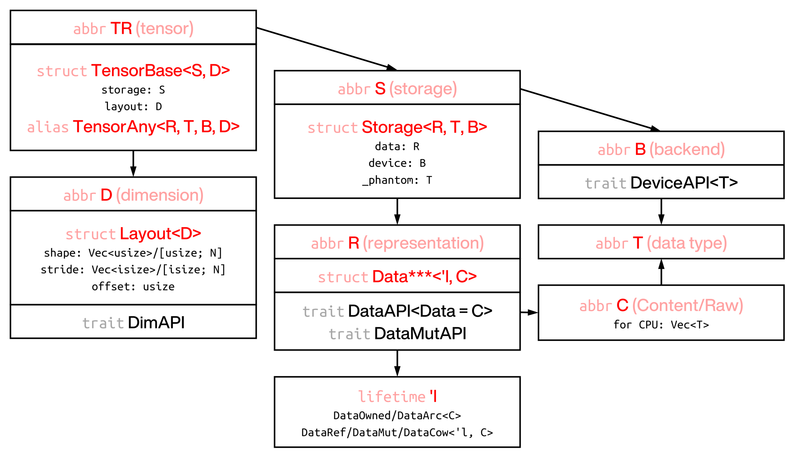

# Tensor Structure and Ownership

In rust, strict rules are applied to ownership and lifetime (related to concept of view).
It is important to know how data (memory of large bulk of floats) is stored and handled, and whether a variable owns or references these data.

As a tensor crate, we also hope to have some unified API functions or operations, that can handle computations both on owned and referenced tensors.
In vulgar words, `numpy` is convenient, and one may hope to code pythonicly in rust.

In this section, we will try to show how RSTSR constructs tensor struct and different ownerships of tensors works.

## 1. Tensor Structure

RSTSR tensor learns a lot from rust crate `ndarray`.
Structure and usage of RSTSR's `TensorBase` is similar to `ndarray`'s `ArrayBase`; however, they are different in some key points.



- Tensor is composed by data (how data is stored in memory bulk) and layout (how tensor is represented).
- Layout is composed by shape (shape of tensor), stride (how each value is accessed from memory bulk), and offset (where the tensor starts)[^1].
- Data is combination of the actual memory storage with the lifetime annotation to it.
  Currently, 5 ownership types are supported. The first two (owned and referenced) are the most important[^2].
    - Owned (`Tensor<T, D, B>`)
    - Referenced (`TensorView<'l, T, D, B>` or `TensorRef<'l, T, D, B>`)
    - Mutablly referenced (`TensorViewMut<'l, T, D, B>` or `TensorMut<'l, T, D, B>`)
    - Clone on write (not mutable enum of owned and referenced, `TensorCow<'l, T, D, B>`)
    - Atomic reference counted (safe in threading, `TensorArc<T, D, B>`)
- Storage is composed by raw memory (type `RawVec`) and backend (device)[^3]
- The actual memory bulk will be stored as `Vec<T>` in CPU, and this can be configured by trait type `RawVec`[^4].
      
[^1]: RSTSR is different to `ndarray` in struct construction.
      While `ndarray` stores shape and stride directly in `ArrayBase`, in RSTSR shape, stride and offset are stored in `Layout<D>`.
      Layout of tensor is meta data of tensor, and it can be detached from data of tensor.

[^2]: In RSTSR, data is stored as variable or its reference, in safe rust.
      This is different to `ndarray`, which stores pointer (with offset) and memory data (if owned) or phantom lifetime annotation (if referenced).

[^3]: This distinguishes RSTSR and `ndarray`.
      We hope that RSTSR will become multi-backend framework in future.
      Currently, we have implemented serial CPU device (`DeviceCpuSerial`) and parallel CPU device with Faer matmul (`DeviceFaer`),
      showing the possiblity of more demanding heterogeneous programming within framework of RSTSR.

[^4]: This distinguishes RSTSR and `candle`.
      RSTSR allows external implementation of backends, hopefully allowing easy extending to other kind of devices, similar to `burn`.
      RSTSR also allows virtaully all kinds of element types (you can take `rug` or even `Vec<T>` as tensor element, as they implemented `Clone`), similar to `ndarray`.
      However, RSTSR will probably not implement autodiff in future, which is drawback compared to `candle` and `burn`.

## 2. Ownership Conversion

### 2.1 Tensor to tensor ownership conversion

Different ownerships can be converted to each other. However, some conversion functions may have some costs (explicit memory copy).

- `view` gives `TensorView<'l, T, D, B>`.
    - This function will always not perform memory copy (of tensor data) in any cases. For this part, it is virtually zero-cost.
    - It will still perform clone of tensor layout, so still some overhead occurs. For large tensor, it is cheap.
- `view_mut` gives `TensorMut<'l, T, D, B>`.
    - In rust, either many const references or only one mutable reference is allowed.
      This is also true for `TensorView` as const reference and `TensorMut` as mutable reference.
- `into_owned_keep_layout` gives `Tensor<T, D, B>`.
    - For `Tensor`, this is free of memory copy;
    - For `TensorView` and `TensorMut`, this requires explicit memory copy. Note that it is usually more proper to use `into_owned` in this case.
    - For `TensorArc`, this is free of memory copy, but please note that it may panic when strong reference count is not exactly one.
      You may use `tensor.data().strong_count()` to check strong reference count.
    - For `TensorCow`, if it is owned (`DataCow::Owned`), then it is free of memory copy; if it is reference (`DataCow::Ref`), then it requires explicit memory copy.
- `into_owned` also gives `Tensor<T, D, B>`.
    - This function is different to `into_owned_keep_layout`, in that `into_owned` only not copy memory when layout of tensor covers all memory (size of memory bulk is the same to size of tensor layout). Calling `into_owned` to any non-trivial slicing of tensor will incur memory copy.
    - Also note that, if you just want to shrink the memory to a slice of tensor, using `into_owned` is more appropriate.
    - For `TensorView` and `TensorMut`, using `into_owned` will copy less memory `into_owned_keep_layout`. So `into_owned` is preferrable for tensor views.
- `into_cow` gives `TensorCow<'l, T, D, B>`.
    - This function does not have any cost.
- `into_shared_keep_layout` and `into_shared` gives `TensorArc<'l, T, D, B>`. This is similar to `into_owned_keep_layout` and `into_owned`.

An example for tensor ownership conversion follows:

```rust
{{#include ../../listings/features-default/tests/structure_and_ownership.rs:tensor_ownership}}
```

### 2.2 Tensor and `Vec<T>` conversion

We have already touched some array creation functions in [previous section](01-tensor_creation.md#2-converting-rust-slices-to-rstsr-tensorview). 
Here we will cover more on this topic.

Converting between Tensor and `Vec<T>` or `&[T]` can be useful if
- transfer data to other objects (such as `candle`, `ndarray`, `nalgebra`),
- need pointer to perform FFI operations (such as BLAS, Lapack),
- export data to be further serialized.

There are some useful functions to perform Tensor to `Vec<T>`:
- `to_vec()`: copy 1-D tensor to vector, requires memory copy;
- `into_vec()`: move 1-D tensor to vector if memory is contiguous; otherwise copy 1-D tensor to vector;
- `into_rawvec()`: move raw tensor to vector; this does not assume output memory bulk layout is the same to tensor layout.

We do not provide functions that give `&[T]` or `&mut [T]`.
However, we provide function `as_ptr()` and `as_mut_ptr()`, giving the pointer of the first element.

Please note the above mentioned utilities only works in CPU.
For other devices (will implemented in future), you may wish to first convert tensor into CPU, then perform Tensor to `Vec<T>` conversion.

As an example, we compute matrix-vector multiplication and report `Vec<f64>`:

```rust
{{#include ../../listings/features-default/tests/structure_and_ownership.rs:to_vec}}
```

### 2.3 Tensor and scalar conversion

RSTSR do not provide method that directly convert `T` to 0-D tensor `Tensor<T, Ix0, B>`.
For convertion of 0-D tensor `Tensor<T, Ix0, B>` to `T`, we provide `to_scalar` function.

As an example, we compute innerdot and report float result:

```rust
{{#include ../../listings/features-default/tests/structure_and_ownership.rs:to_scalar}}
```

## 3. Dimension Conversion

RSTSR provides fixed dimension and dynamic dimension tensors. Dimensions can be converted by `into_dim::<D>()` or `into_dyn`.

```rust
{{#include ../../listings/features-default/tests/structure_and_ownership.rs:dim_conversion}}
```

We only touched array creation with fixed dimension. To create array with dynamic dimension, use `Vec<T>` instead of `[T; N]`:

```rust
{{#include ../../listings/features-default/tests/structure_and_ownership.rs:dyn_dim_construct}}
```

Fixed dimension will be more efficient than dynamic dimension. However, in many arithmetic computations, depneding on contiguous of tensors, the efficiency difference will not be very notable.

<div class="warning">

**Fixed dimension is not equilvalent to fixed shape/strides.**

For dimensionality, RSTSR uses similar workarounds to rust crate `ndarray`, which provides only fixed dimension.
Fixed dimension means $n$ is fixed at compile time for $n$-D tensor. This is different to numpy, which dimension is always dynamic.

RSTSR is very different to rust crates `nalgebra` and `dfdx`; these rust crates supports fixed shape and strides.
That is to say, not only dimension $n$ is fixed, but also shape and strides are known at compile time.
For small vectors or matrices, fixing shape and strides can usually be compiled to much more efficient assembly code.
For large vectors or matrices, that will depends on types of arithmetic computations;
compiler with `-O3` is not omniscient, and in most cases, fixing shape and strides will not benefit more than manual cache, pipeline and multi-threading optimization.

RSTSR, by design and motivation, is for scientific computation for medium or large tensors.
By concerning benefits and difficulties, we choose not introducing fixed shape and strides.
This leaves RSTSR not suitable for tasks that handling small matrices (such as gaming and shading).
For some tasks that are sensitive to certain shapes (such as filter shape of CNN in deep learning), RSTSR is suitable for tensor storage, and user may wish to use custom computation functions instead of RSTSR's to perform computation intensive parts.

</div>
